## Overview

In this project, I implemented a rasterizer that supports triangle rasterization, supersampling-based antialiasing, 2D transforms, barycentric coordinate interpolation, texture mapping with pixel sampling and level sampling, and transformation from png to svg using quadtree(Extra Credit).

Key takeaways:

- Rasterization performance is heavily influenced by memory access patterns. Seemingly obvious optimizations (like pre-calculating constants or changing loop order) can actually hurt performance due to cache effects. Tiled traversal with tile size 8 achieved the best speedup (~1.8x over naive) by balancing computation savings with cache-friendly access.
- Antialiasing is fundamentally about trading computation/memory for visual quality. Supersampling is conceptually the simplest but most expensive; pixel-level bilinear sampling and mipmap-based level sampling offer better cost-quality tradeoffs.

## Task 1: Drawing Single-Color Triangles

### Q1. Walk through how you rasterize triangles in your own words.

- Ensure counterclockwise winding by checking the cross product of edge vectors; swap vertices if needed.
- Compute the bounding box and clamp it to screen bounds.
- Iterate over 8&times;8 tiles within the bounding box. Test each tile against the triangle: if fully inside, rasterize all pixels without per-pixel edge tests; if fully outside, skip entirely; otherwise, test each pixel individually.
- For each candidate pixel, sample at its center (+0.5, +0.5 offset) and evaluate three edge functions. A pixel is filled if it passes all three tests, using OpenGL top-left edge rules for tie-breaking.

### Q2. Explain how your algorithm is no worse than one that checks each sample within the bounding box of the triangle.

- First, I test a tile of pixels first. If the tile is fully inside/outside of the triangle, then skip the test of pixels in the tile. If not the case, test each pixel in the tile explicitly. Using the tiled triangle traversal, I decrease the computation.
- Second, instead of testing pixels independently, I test pixels based on previous result: by utilizing the linear feature of line function, I degenerate the expensive multiplication into cheap addition.

### Q3. Show a png screenshot of basic/test4.svg with the default viewing parameters and with the pixel inspector centered on an interesting part of the scene.

<figure>
  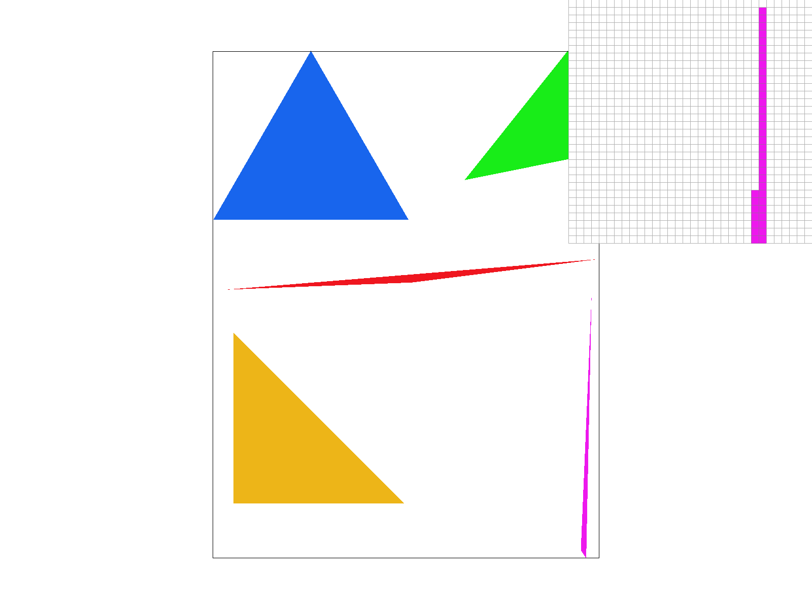
  <figcaption>test4.svg - This part shows explicitly jaggies in the sharp edge of the purple triangle.</figcaption>
</figure>

### Extra Credit: Special optimizations beyond simple bounding box triangle rasterization

The following statistic is based on running for 200 times and the first 100 results are excluded to fully warm up the cache.

| Version | Mean (ms) | Std (ms) | Notes |
|---------|-----------|----------|-------|
| V1: Naive | 0.979 | 0.029 | Baseline |
| V2: Pre-calculate constants | 1.037 | 0.025 | Slower: compiler already did this; extra variables hurt cache |
| V3: Exchange loop order (y-x) | 1.219 | 0.025 | Slower: original x-y order fits cache line better |
| V4: Incremental traversal | 0.801 | 0.024 | Use addition instead of multiplication via linear property of edge functions |
| V5: Tiled (tile=2) | 1.238 | 0.048 | Too small tile, overhead dominates |
| V5: Tiled (tile=4) | 0.643 | 0.034 | |
| V5: Tiled (tile=8) | 0.545 | 0.034 | Best: ~1.8x speedup over naive |
| V5: Tiled (tile=16) | 0.640 | 0.038 | |
| V5: Tiled (tile=32) | 0.934 | 0.030 | Larger tiles reduce benefit of skipping |

**Tiled traversal (tile=8):** First test a block of pixels. If the block is fully inside the triangle, simply rasterize all pixels without per-pixel edge tests. If the block is fully outside the triangle, skip it entirely. Otherwise, fall back to incremental traversal within the block.

**Why some "optimizations" slow down:**

**V2 (Pre-calculate constants):** The compiler already performs constant folding in the naive version, so manually hoisting edge-test constants into local variables adds register pressure without saving computation.

**V3 (Exchange loop order):** V3 changed the loop order from x-outer y-inner to y-outer x-inner. The sample buffer is indexed as `(y * width + x) * sample_rate + ...` (row-major), so y-outer x-inner should theoretically be more cache-friendly (inner loop stride = `sample_rate`, vs `width * sample_rate` for x-outer y-inner). Yet V3 is consistently slower. Possible explanations: (1) the compiler may generate different auto-vectorization or loop-unrolling strategies for the two loop structures; (2) hardware prefetcher heuristics may interact differently with the two access patterns; (3) branch prediction for the triangle edge test may behave differently&mdash;scanning along rows vs columns produces different inside/outside transition patterns depending on triangle geometry.

To further verify, I reverted V2 and V3 individually on top of the best tiled version (tile=8):

| Variant (tile=8 base) | Mean (ms) | Std (ms) |
|------------------------|-----------|----------|
| All optimizations (V2+V3+V4+V5) | 0.545 | 0.034 |
| Revert V2 (pre-calculate) only | 0.583 | 0.022 |
| Revert V3 (loop order) only | 0.526 | 0.025 |
| Revert both V2 and V3 | 0.571 | 0.027 |

Reverting V3 alone yields the best result (0.526 ms), consistent with V3 hurting performance even within tiled traversal.

## Task 2: Antialiasing by Supersampling

### Q1. Walk through your supersampling algorithm and data structures.

- Step 1: Divide one original pixel into sqrt(sample_rate) &times; sqrt(sample_rate) subpixels.
- Step 2: Evaluate each subpixel as a normal pixel to decide whether or not to rasterize it.
- Step 3: Write the rasterize results of subpixels into the sample buffer.
- Step 4: Sum up the colors of all subpixels belonging to one pixel then divide by sample rate to get the final color.

### Q2. Why is supersampling useful?

It takes the average of color across multiple sub-pixel samples within one pixel, which smooths out jagged edges (aliasing artifacts) along triangle boundaries.

### Q3. What modifications did you make to the rasterization pipeline in the process?

For triangles: evaluate subpixels then take the average color of subpixels, as described in Q1.

For points and lines: fill up all subpixels in one pixel with the same color to maintain consistent behavior.

### Q4. Explain how you used supersampling to antialias your triangles.

By averaging the color from multiple sub-pixel samples, partially-covered pixels at triangle edges get intermediate color values instead of being either fully colored or fully background. This produces smooth gradual transitions at edges rather than hard staircase patterns.

### Q5. Show png screenshots of basic/test4.svg with sample rates 1, 4, and 16.

  <table>
    <tr>
      <td>
        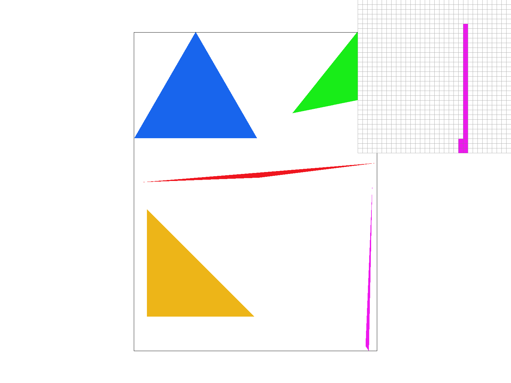
        <figcaption>Sample rate 1</figcaption>
      </td>
      <td>
        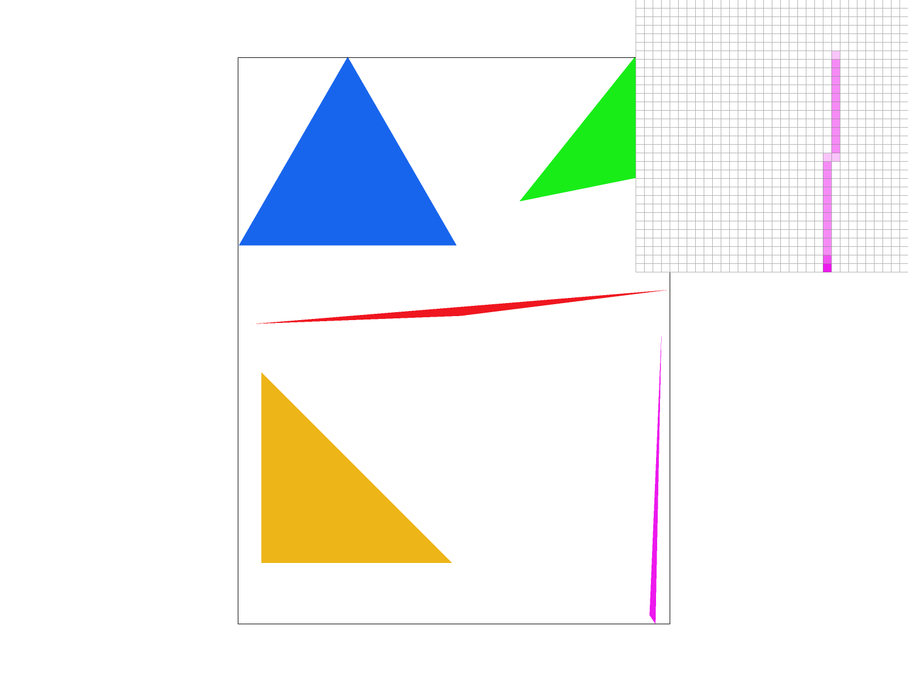
        <figcaption>Sample rate 4</figcaption>
      </td>
    </tr>
    <tr>
      <td colspan="2">
        
        <figcaption>Sample rate 16</figcaption>
      </td>
    </tr>
  </table>

When sample rate = 1, the skinny triangle corner exhibits severe jaggies: pixels are binary (fully colored or background). When sample rate = 4, partially-covered pixels receive intermediate colors, visibly smoothing edges. When sample rate = 16, the finer sub-pixel resolution captures even subtler degrees of coverage, producing nearly continuous transitions at triangle boundaries.

### Extra Credit: Jittered Sampling

I implemented jittered sampling, which replaces the fixed 0.5 sub-pixel offset with a random value between 0 and 1 for each sample.

  <table>
    <tr>
      <td>
        
        <figcaption>Grid-based supersampling (16 spp)</figcaption>
      </td>
      <td>
        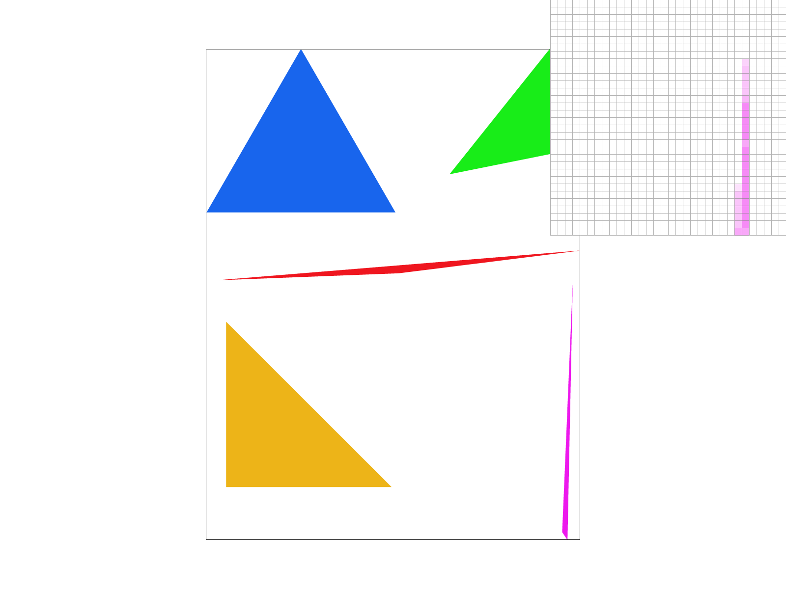
        <figcaption>Jittered sampling (16 spp)</figcaption>
      </td>
    </tr>
  </table>

Jittered sampling replaces grid sampling's regular aliasing patterns (which can produce structured artifacts at certain frequencies) with stochastic noise, which is generally less visually objectionable. At high sample counts the two methods converge, but at lower counts jittered sampling avoids the systematic miss/hit patterns that regular grids can exhibit along triangle edges.

## Task 3: Transforms

### Q1. Create an updated version of cubeman doing something more interesting.

<figure>
  
  <figcaption>I made the cubeman waving using his right hand.</figcaption>
</figure>

### Extra Credit: Viewport rotation

I added two keys to rotate the viewport left and right.

  <table>
    <tr>
      <td>
        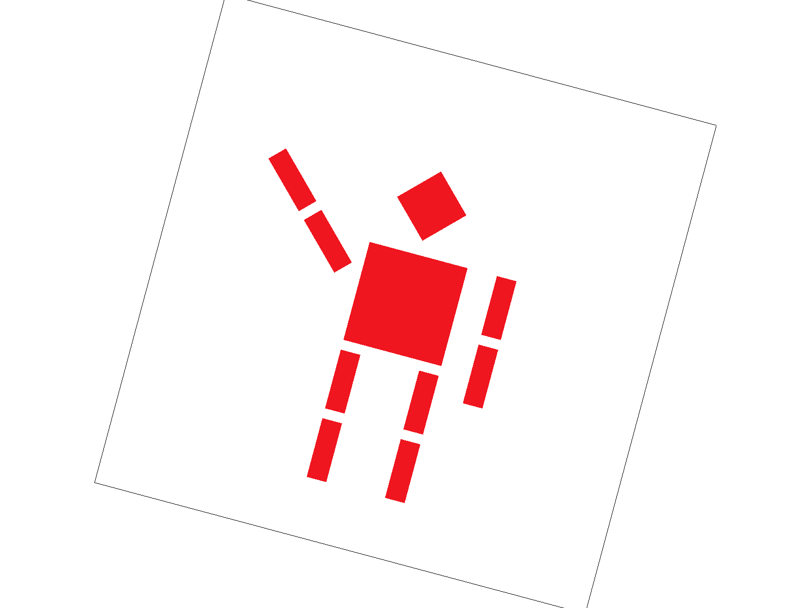
        <figcaption>Right rotation</figcaption>
      </td>
      <td>
        
        <figcaption>Normal</figcaption>
      </td>
      <td>
        
        <figcaption>Left rotation</figcaption>
      </td>
    </tr>
  </table>

Modification: Added a rotation matrix `rotation = translate(0.5, 0.5) * rotate(angle) * translate(-0.5, -0.5)` into the matrix stack: `ndc_to_screen * rotation * svg_to_ndc[current_svg]`. The translation to (0.5, 0.5) and back ensures rotation happens around the center of the NDC space rather than the origin.

## Task 4: Barycentric coordinates

### Q1. Explain barycentric coordinates in your own words.

Barycentric coordinates decompose a point into a linear combination of three vertices. Mathematically, given a point P and triangle vertices A, B, C: $ P = \alpha A + \beta B + \gamma C $, where $ \alpha = S_{PBC} / S_{ABC} $, $ \beta = S_{PAC} / S_{ABC} $, $ \gamma = S_{PAB} / S_{ABC} $. Each coefficient represents the relative area of the sub-triangle opposite to the corresponding vertex, normalized by the total triangle area.

<figure>
  
  <figcaption>A single triangle with red, green, and blue vertices. The smooth color blending demonstrates how barycentric coordinates interpolate attributes across the triangle surface.</figcaption>
</figure>

### Q2. Show a png screenshot of svg/basic/test7.svg with default viewing parameters and sample rate 1.

<figure>
  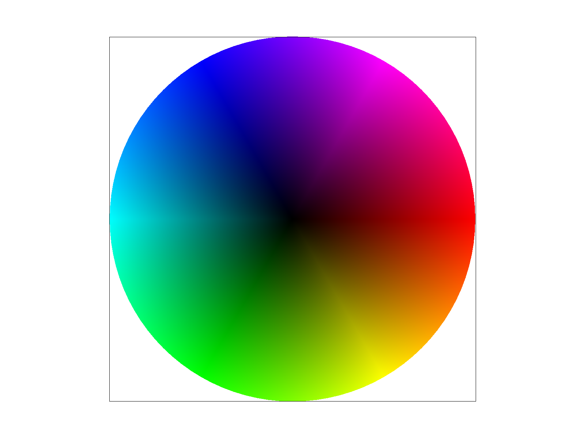
  <figcaption>test7.svg - Color wheel rendered using barycentric coordinate interpolation.</figcaption>
</figure>

## Task 5: "Pixel sampling" for texture mapping

### Q1. Explain pixel sampling and describe how you implemented it for texture mapping. Briefly discuss the two different pixel sampling methods, nearest and bilinear.

Pixel sampling maps screen-space pixel coordinates to texture coordinates (u, v) to retrieve color values from the texture.

Implementation:

- **Nearest:** Compute the (u, v) coordinates by interpolating the UV coordinates of the three vertices using barycentric coordinates. Then take the floor of (u, v) to find the nearest texel.
- **Bilinear:** Compute the (u, v) coordinates the same way. Then subtract a (0.5, 0.5) offset and find the 4 surrounding texels. Finally, perform bilinear interpolation of these 4 texels' colors using the fractional offsets as weights.

Comparison:

- **Nearest:** Cheaper computation (single texel lookup), but produces blocky artifacts and visible jaggies at texture boundaries.
- **Bilinear:** Slightly more expensive (4 texel lookups + 3 lerps), but produces smoother results at the cost of some detail sharpness.

### Q2. Show and compare four png screenshots using nearest/bilinear sampling at 1 and 16 samples per pixel.

  <table>
    <tr>
      <td>
        
        <figcaption>Nearest, 1 spp</figcaption>
      </td>
      <td>
        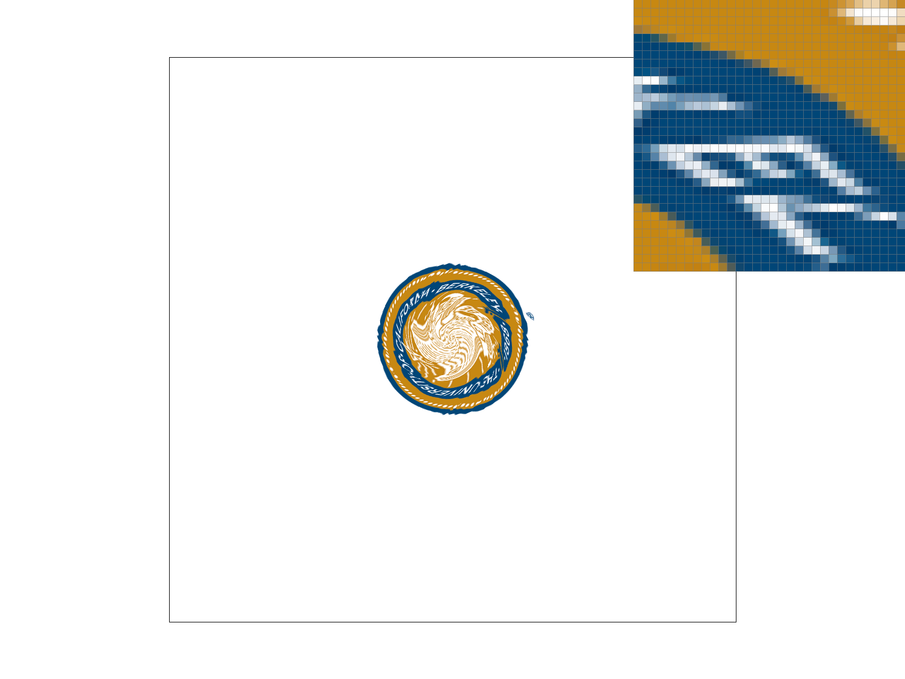
        <figcaption>Bilinear, 1 spp</figcaption>
      </td>
    </tr>
    <tr>
      <td>
        
        <figcaption>Nearest, 16 spp</figcaption>
      </td>
      <td>
        
        <figcaption>Bilinear, 16 spp</figcaption>
      </td>
    </tr>
  </table>

At 1 sample per pixel, nearest sampling shows clear blocky artifacts and sharp discontinuities at texel boundaries, while bilinear sampling produces noticeably smoother transitions. At 16 samples per pixel, both methods improve significantly since supersampling itself provides smoothing, but bilinear still shows slightly smoother results. The gap between nearest and bilinear is much larger at 1 spp than at 16 spp, because supersampling partially compensates for nearest sampling's blockiness.

### Q3. Comment on the relative differences. Discuss when there will be a large difference between the two methods and why.

The gap is largest during texture magnification (each texel maps to multiple screen pixels): nearest sampling produces blocky patches while bilinear smoothly interpolates between texels. The difference is minimal when texture and screen resolutions are closely matched (1:1 mapping), or when a high supersampling rate provides enough spatial averaging to mask nearest sampling's artifacts.

## Task 6: "Level Sampling" with mipmaps for texture mapping

### Q1. Explain level sampling in your own words and describe how you implemented it for texture mapping.

Level sampling selects an appropriate mipmap level based on the screen-space footprint of a pixel in texture space, then samples the texture from that level. The goal is to match the texel density to the pixel density, avoiding aliasing from undersampling and unnecessary blur from oversampling.

Implementation:

- **L_ZERO:** Always sample from the full-resolution (level 0) mipmap.
- **L_NEAREST:** Compute the mipmap level as log2 of the maximum norm of the screen-space derivatives (dx_uv, dy_uv), then round to the nearest integer. Sample from that single mipmap level.
- **L_LINEAR:** Compute the continuous mipmap level the same way, then sample from both the floor and ceiling levels and linearly interpolate between them.
- **L_ANISOTROPIC:** Compute the mipmap level using the *shorter* of the two derivatives, so the selected level preserves detail along the minor axis. Then take multiple samples along the longer derivative direction and average them. This avoids the over-blurring that isotropic mipmaps produce at oblique viewing angles.

### Q2. Describe the tradeoffs between pixel sampling, level sampling, and supersampling.

| Technique | Speed | Memory | Antialiasing Power |
|-----------|-------|--------|--------------------|
| **Pixel sampling** (nearest vs bilinear) | Fastest. Nearest requires 1 texel lookup; bilinear requires 4 lookups + 3 lerps. Negligible overhead either way. | No additional memory beyond the base texture. | Bilinear smooths magnification artifacts but does not address minification aliasing. Limited antialiasing power on its own. |
| **Level sampling** (mipmaps) | Moderate. Requires computing screen-space derivatives per pixel. L_NEAREST adds one extra level lookup; L_LINEAR doubles the pixel sampling cost; anisotropic multiplies it by the anisotropy ratio. | Mipmaps require ~33% extra memory. | Effectively handles minification aliasing by pre-filtering the texture at multiple scales. Combined with bilinear pixel sampling, produces smooth results across varying texture densities. |
| **Supersampling** | Slowest. Cost scales linearly with sample rate: 16 spp is 16x the work of 1 spp, including both rasterization and texture lookups. | Sample buffer scales linearly with sample rate: 16 spp requires 16x the framebuffer memory. | Most general: reduces aliasing very well. But brute-force and expensive. |

### Q3. Show four versions of an image using combinations of L_ZERO/L_NEAREST and P_NEAREST/P_LINEAR.

  <table>
    <tr>
      <td>
        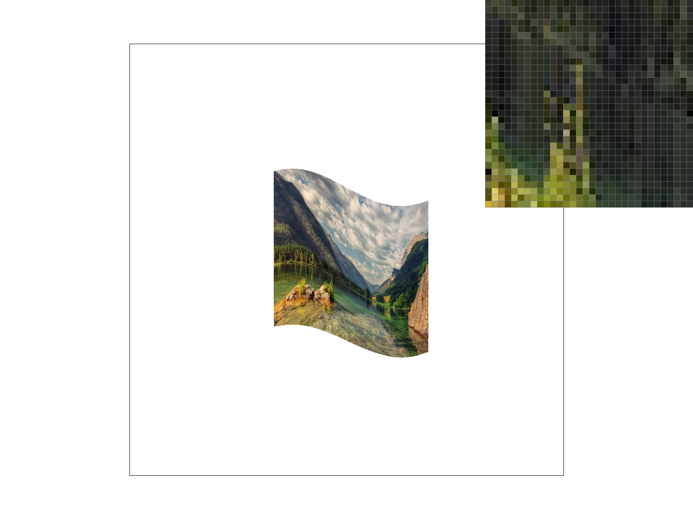
        <figcaption>L_ZERO, P_NEAREST</figcaption>
      </td>
      <td>
        
        <figcaption>L_ZERO, P_BILINEAR</figcaption>
      </td>
    </tr>
    <tr>
      <td>
        
        <figcaption>L_NEAREST, P_NEAREST</figcaption>
      </td>
      <td>
        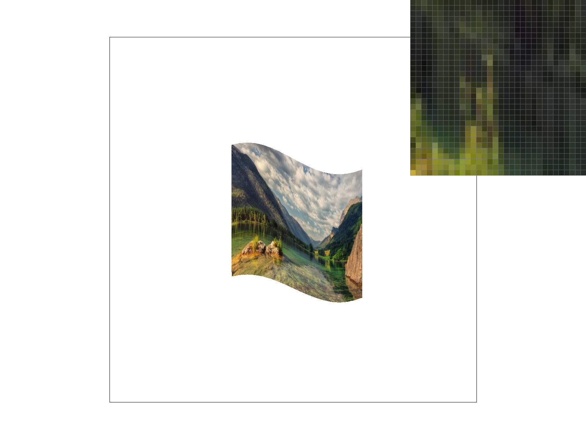
        <figcaption>L_NEAREST, P_BILINEAR</figcaption>
      </td>
    </tr>
  </table>

### Extra Credit: Anisotropic Filtering

I implemented anisotropic filtering: the mipmap level is computed using the shorter of the two screen-space derivatives (dx_uv, dy_uv), preserving detail along the minor axis. Then, multiple samples are taken along the longer derivative direction at that mipmap level and averaged. This prevents the over-blurring that standard isotropic mipmaps produce when surfaces are viewed at oblique angles, because the filtering shape matches the elongated pixel footprint in texture space rather than approximating it as a square.

## Extra Credit: Draw Something Creative

Generated using an adaptive quadtree-based SVG generation script (`src/generate_svg.cpp`) that converts a PNG image into color-interpolated SVG triangles (with AI help). Below is a comparison at different triangle budgets:

  <table>
    <tr>
      <td>
        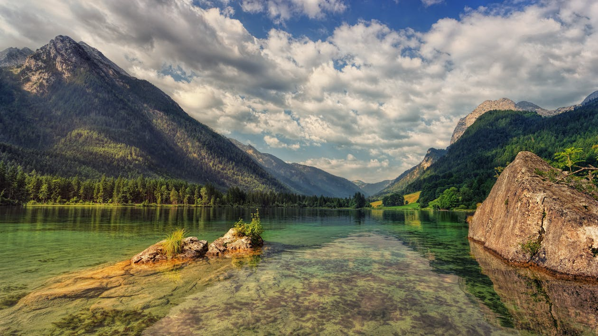
        <figcaption>Original</figcaption>
      </td>
      <td>
        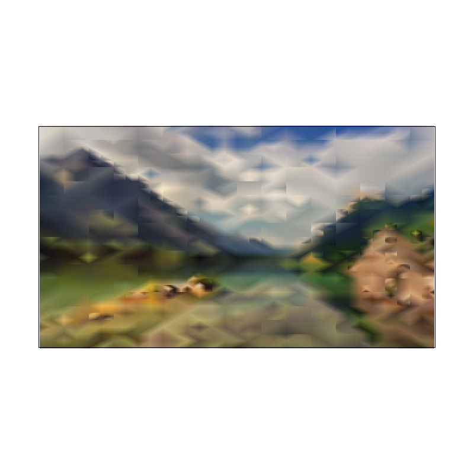
        <figcaption>2,000 triangles</figcaption>
      </td>
    </tr>
    <tr>
      <td>
        
        <figcaption>4,000 triangles</figcaption>
      </td>
      <td>
        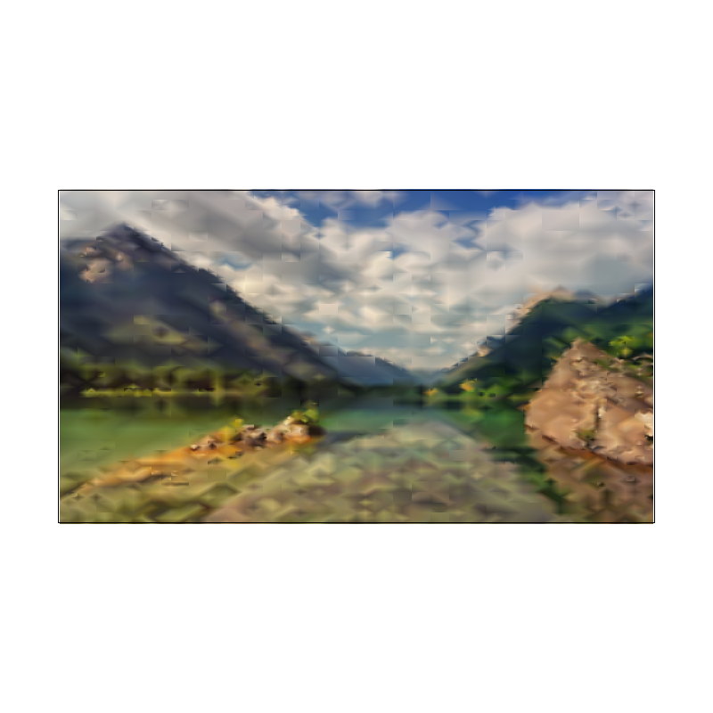
        <figcaption>8,000 triangles</figcaption>
      </td>
    </tr>
    <tr>
      <td>
        
        <figcaption>16,000 triangles</figcaption>
      </td>
      <td>
        
        <figcaption>32,000 triangles (The one I use for competition)</figcaption>
      </td>
    </tr>
  </table>

With more triangles, the quadtree subdivides finer, and the rendering progressively recovers detail in high-frequency regions (mountain edges, water reflections) while smooth areas (sky, water surface) remain coarse.

### Algorithm Overview

The core idea is to adaptively partition the image into axis-aligned rectangles using a quadtree, then split each rectangle along a diagonal into two color-interpolated triangles. Regions with more visual complexity receive finer subdivision, preserving detail where it matters while using fewer triangles in smooth areas.

### Key Techniques

- **Canny edge-guided subdivision priority:** A Canny edge detector identifies high-frequency regions in the image. The edge map is incorporated into the subdivision error metric via an integral image, so rectangles containing more edge pixels are prioritized for splitting. This concentrates triangles along object boundaries and fine details.
- **Integral images for O(1) error computation:** Precomputed integral images (both sum and sum-of-squares) for each color channel enable constant-time SSE (sum of squared errors) queries over any axis-aligned rectangle. The SSE measures color variance within a region: $ \text{SSE} = \sum x_i^2 - (\sum x_i)^2 / n $. High SSE indicates the region is too complex to represent with a single color gradient and should be subdivided.
- **Max-heap priority queue:** All candidate rectangles are stored in a max-heap ordered by their error metric. At each step, the rectangle with the highest error is popped and split into four children. This greedy strategy ensures the triangle budget is spent on the regions that benefit most from subdivision.
- **Adaptive diagonal selection:** Each rectangle is split into two triangles along one of its diagonals. The algorithm compares the color difference between the two pairs of opposite corners (TL-BR vs TR-BL) and chooses the diagonal whose endpoints are more similar in color. This reduces visible seams along the diagonal edge.
- **Vertex color averaging:** Instead of sampling a single pixel at each corner, vertex colors are computed as the average over a small local window (3&times;3) using the integral images. This smooths out noise and produces more natural color transitions between adjacent triangles.
