## Overview

In this project, I implemented geometric modeling techniques including Bezier curve/surface evaluation using de Casteljau's algorithm, triangle mesh operations (area-weighted vertex normals, edge flip, edge split), and Loop subdivision for mesh upsampling. I also implemented support for boundary edges and the modified Butterfly subdivision scheme as extra credit.

Key takeaways:

- The half-edge data structure is powerful but error-prone: careful bookkeeping of all pointer reassignments (drawing "before" and "after" diagrams) is essential for correctness in mesh operations like edge flip and split.
- Loop subdivision's averaging behavior smooths sharp features. Pre-processing (splitting edges or flipping diagonals) can preserve symmetry and reduce unwanted smoothing by controlling vertex valence before subdivision.

## Section I: Bezier Curves and Surfaces

### Part 1: Bezier curves with 1D de Casteljau subdivision

#### Q1. Briefly explain de Casteljau's algorithm and how you implemented it in order to evaluate Bezier curves.

de Casteljau's algorithm: Given N control points and parameter t, use linear interpolation to compute the N-1 control points of the next subdivision level. By applying this step recursively, we finally get a single point that lies on the Bezier curve.

Implementation: Given a vector of points, for i from 0 to size-1, use the lerp function to compute the control points of the next subdivision level. Repeat this recursively until a single point remains.

#### Q2. Take a look at the provided .bzc files and create your own Bezier curve with 6 control points of your choosing. Use this Bezier curve for your screenshots below.

#### Q3. Show screenshots of each step / level of the evaluation from the original control points down to the final evaluated point.

  <table>
    <tr>
      <td>
        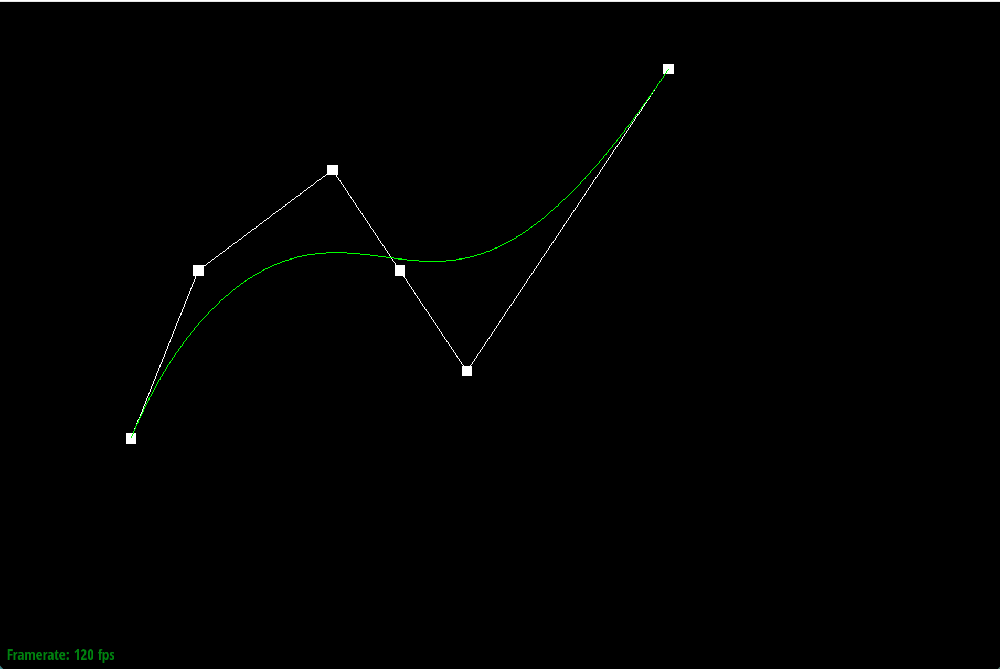
        <figcaption>Level 0 (original control points)</figcaption>
      </td>
      <td>
        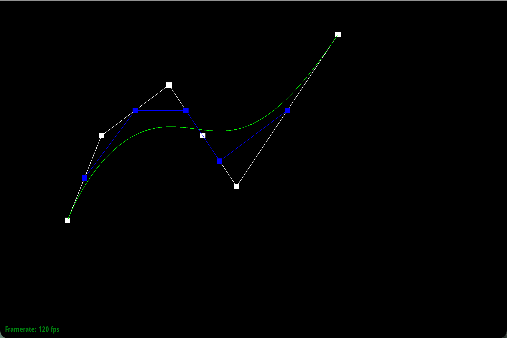
        <figcaption>Step 1</figcaption>
      </td>
    </tr>
    <tr>
      <td>
        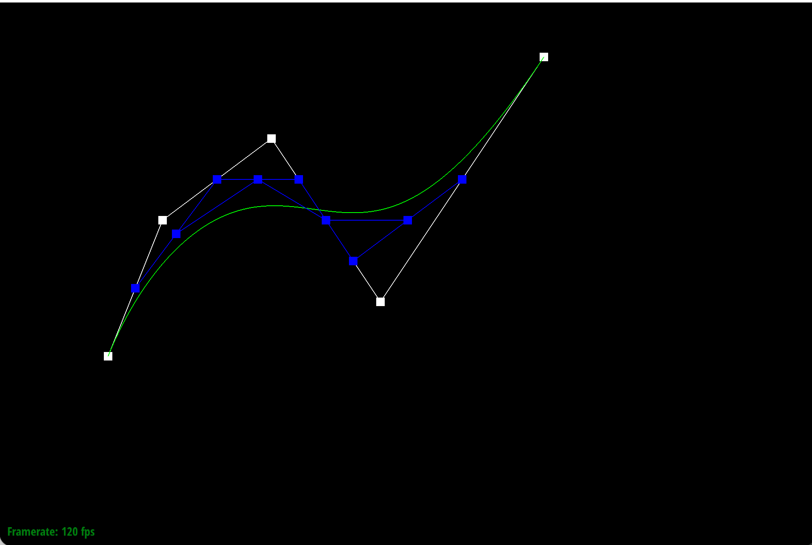
        <figcaption>Step 2</figcaption>
      </td>
      <td>
        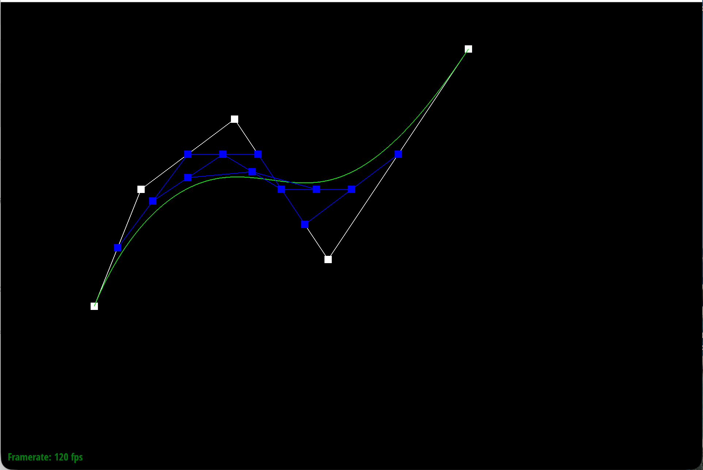
        <figcaption>Step 3</figcaption>
      </td>
    </tr>
    <tr>
      <td>
        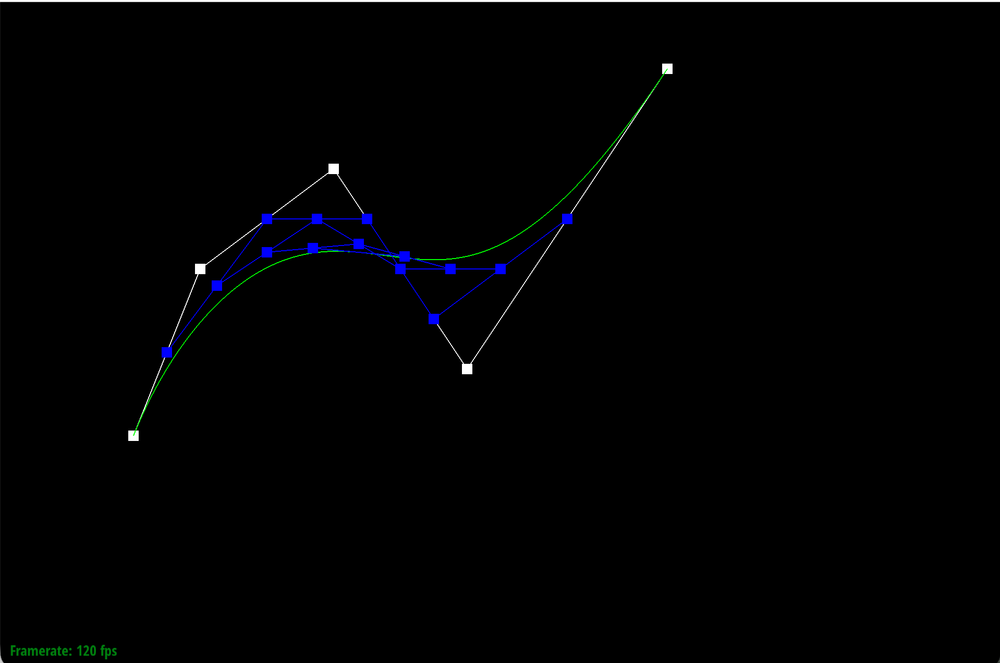
        <figcaption>Step 4</figcaption>
      </td>
      <td>
        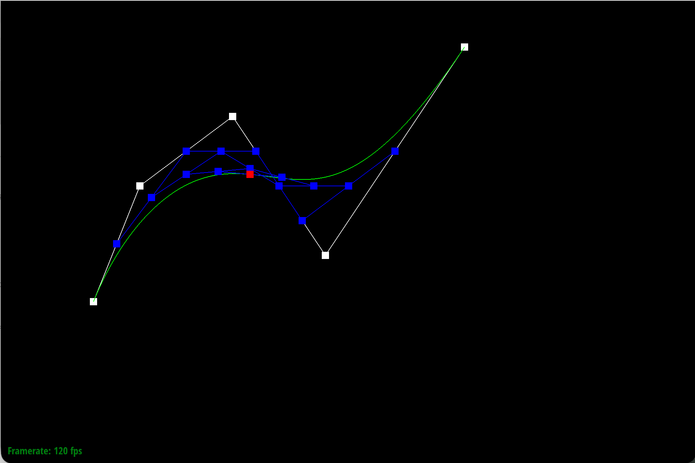
        <figcaption>Step 5 (final evaluated point)</figcaption>
      </td>
    </tr>
  </table>

#### Q4. Show a screenshot of a slightly different Bezier curve by moving the original control points around and modifying the parameter t via mouse scrolling.

<figure>
  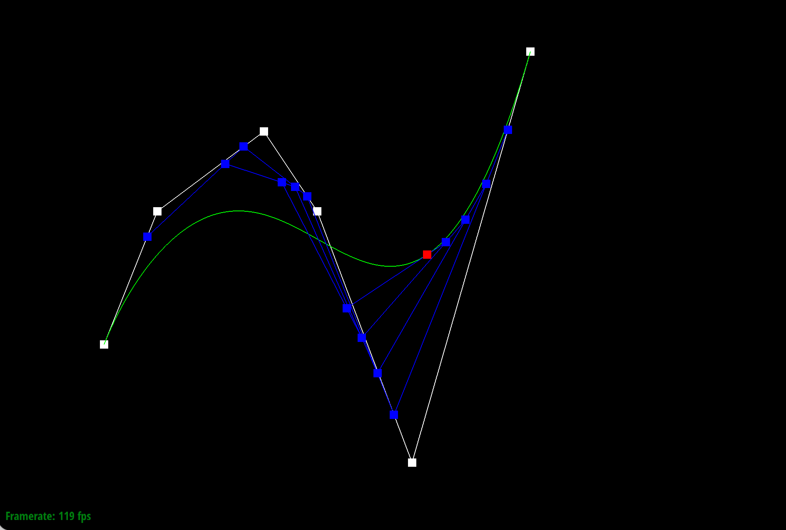
  <figcaption>Modified Bezier curve with different control point positions and parameter t.</figcaption>
</figure>

### Part 2: Bezier surfaces with separable 1D de Casteljau

#### Q1. Briefly explain how de Casteljau algorithm extends to Bezier surfaces and how you implemented it in order to evaluate Bezier surfaces.

Extension: Apply de Casteljau's algorithm to each row of control points, reducing each row to a single point. Then use all of these points (which form a new set of size n) to run de Casteljau's algorithm one more time.

Implementation: Repeatedly call evaluateStep (evaluate1D) to reduce the control points to a single point and collect the final points into a vector. Finally, call evaluate1D on the final points to get a point on the surface.

#### Q2. Show a screenshot of bez/teapot.bez (not .dae) evaluated by your implementation.

<figure>
  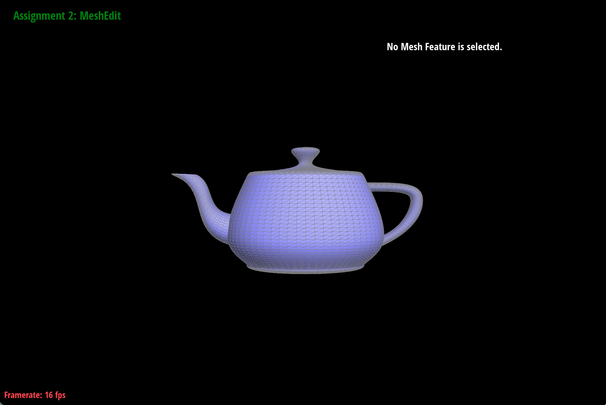
  <figcaption>Teapot rendered from bez/teapot.bez using Bezier surface evaluation.</figcaption>
</figure>

## Section II: Triangle Meshes and Half-Edge Data Structure

### Part 3: Area-weighted vertex normals

#### Q1. Briefly explain how you implemented the area-weighted vertex normals.

1. Get the vertex's halfedge `h`.
2. Use a `do-while` loop, advancing via `h = h->twin()->next()`, to traverse all incident faces around the vertex.
3. For each face, retrieve the two edge vectors from the vertex and compute their cross product, which gives the face normal scaled by the parallelogram area (i.e., area-weighted).
4. Accumulate all area-weighted normals and normalize the result.

#### Q2. Show screenshots of dae/teapot.dae comparing teapot shading with and without vertex normals.

  <table>
    <tr>
      <td>
        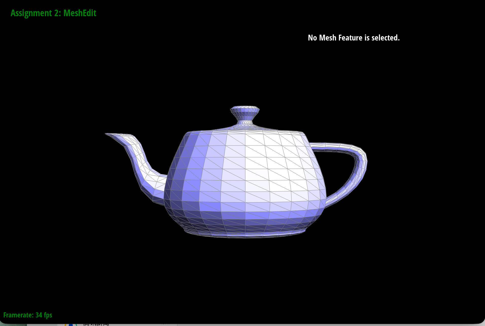
        <figcaption>Without vertex normals (flat shading)</figcaption>
      </td>
      <td>
        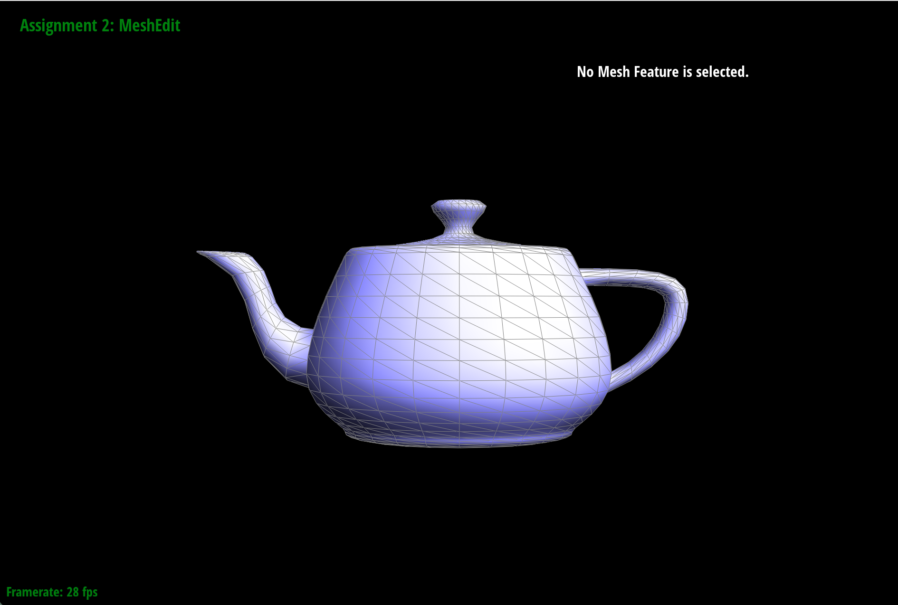
        <figcaption>With vertex normals (Phong shading)</figcaption>
      </td>
    </tr>
  </table>

### Part 4: Edge flip

#### Q1. Briefly explain how you implemented the edge flip operation and describe any interesting implementation / debugging tricks you have used.

I followed the guidance: first collect all iterators from the "before" picture, then reassign them according to the "after" picture.

Implementation Tricks: Reassign pointers by triangles.

#### Q2. Show screenshots of the teapot before and after some edge flips.

  <table>
    <tr>
      <td>
        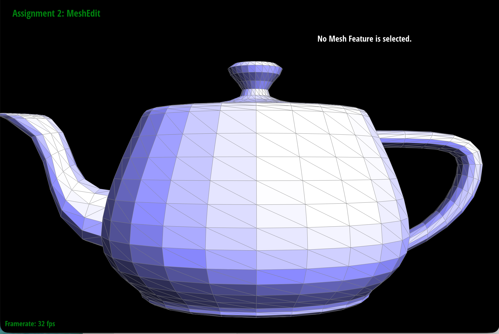
        <figcaption>Before edge flips</figcaption>
      </td>
      <td>
        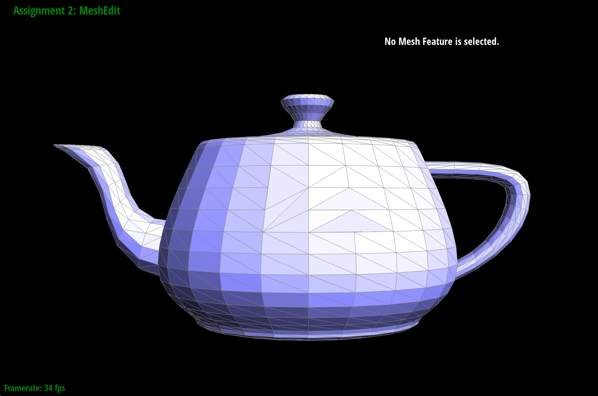
        <figcaption>After edge flips</figcaption>
      </td>
    </tr>
  </table>

#### Q3. Write about your eventful debugging journey, if you have experienced one.

1. I initially wrote `v0 = h2->vertex()`, which simply reassigns the local iterator rather than updating the mesh. Instead, I should write `v0->halfedge() = h2`, which updates the vertex's halfedge pointer.

2. I was confused about the degenerate case: Suppose D is the midpoint of BC of triangle ABC and we want to flip AD. The result is that the edge AD is deleted and no new edge is created, illustrated by the pictures:

  <table>
    <tr>
      <td>
        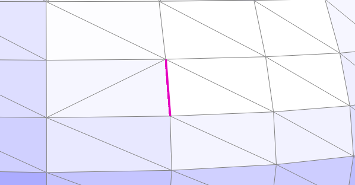
        <figcaption>Before flip (degenerate case)</figcaption>
      </td>
      <td>
        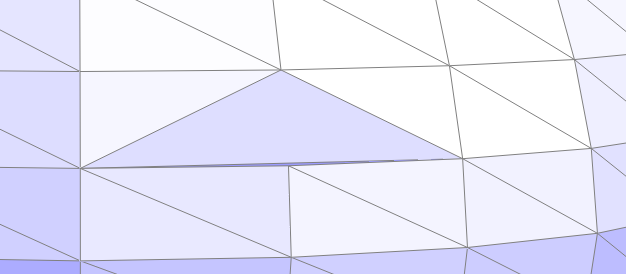
        <figcaption>After flip (degenerate case)</figcaption>
      </td>
      <td>
        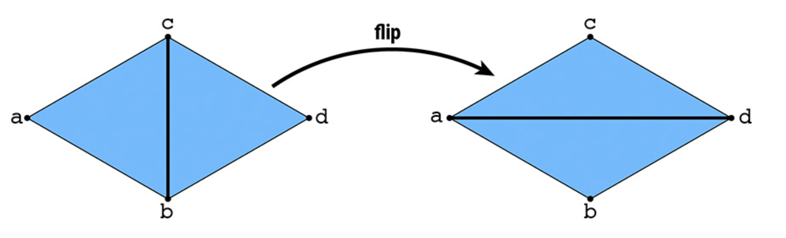
        <figcaption>Correct understanding</figcaption>
      </td>
    </tr>
  </table>

It took me quite a while to get the answer: flipping AD creates a new edge BC, which already exists, and therefore it seems like only AD is deleted and no new edge is created.

### Part 5: Edge split

#### Q1. Briefly explain how you implemented the edge split operation and describe any interesting implementation / debugging tricks you have used.

The implementation process is quite similar to Part 4: draw the "Before" and "After" diagrams and reassign pointers accordingly.

Implementation tricks: Do not move the external edges, otherwise you have to store their original next halfedges and faces.

#### Q2. Show screenshots of a mesh before and after some edge splits.

  <table>
    <tr>
      <td>
        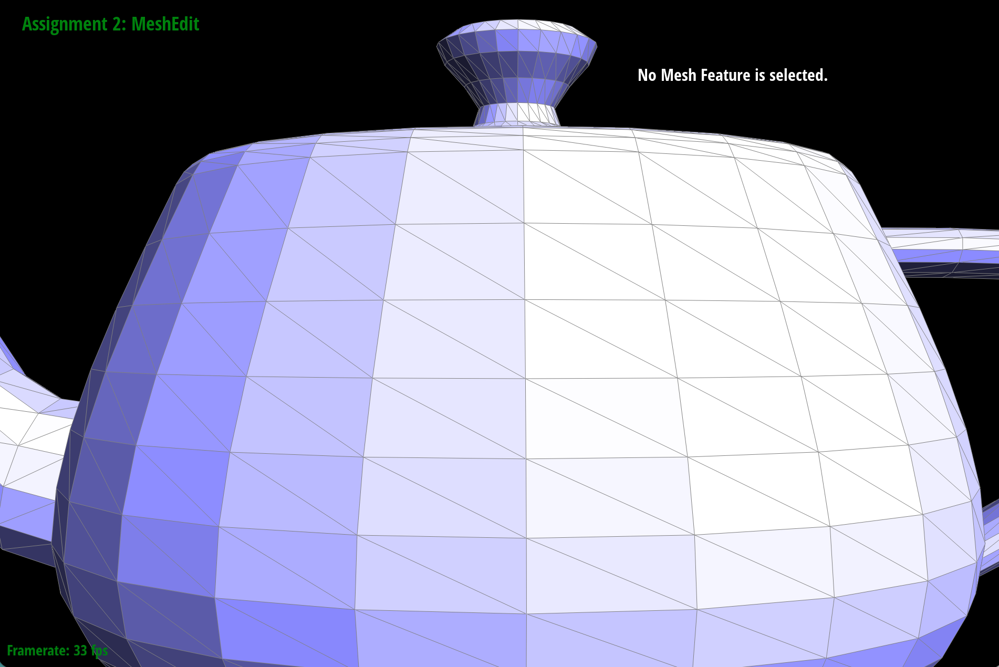
        <figcaption>Before edge splits</figcaption>
      </td>
      <td>
        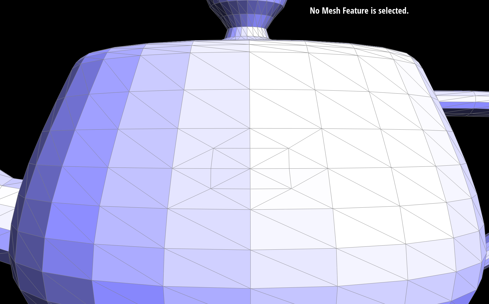
        <figcaption>After edge splits</figcaption>
      </td>
    </tr>
  </table>

#### Q3. Show screenshots of a mesh before and after a combination of both edge splits and edge flips.

  <table>
    <tr>
      <td>
        
        <figcaption>Before edge splits and flips</figcaption>
      </td>
      <td>
        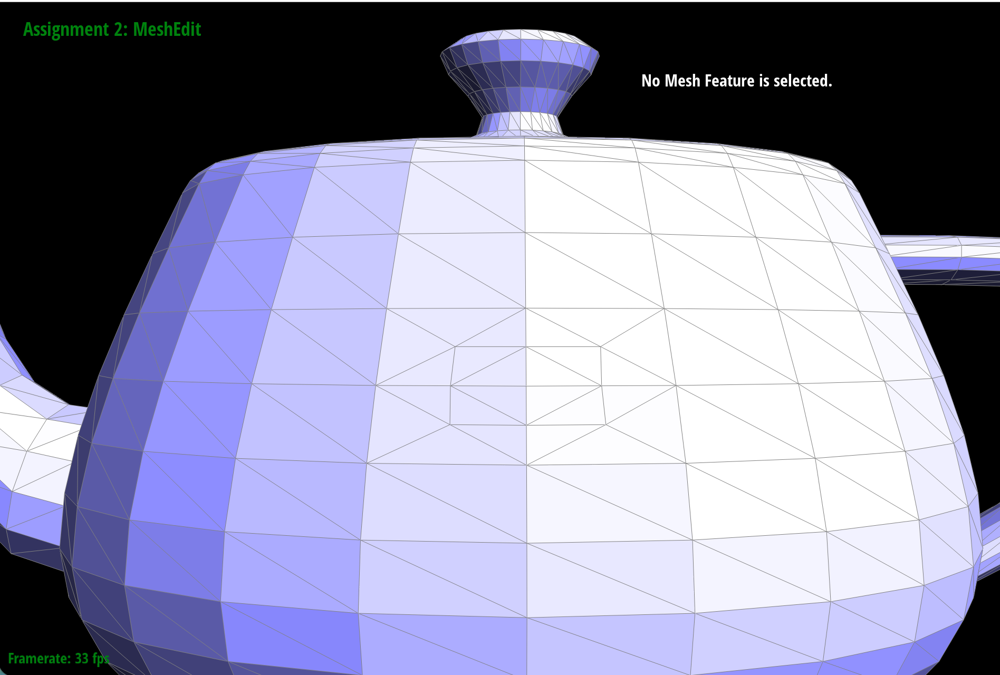
        <figcaption>After edge splits and flips</figcaption>
      </td>
    </tr>
  </table>

#### Q4. Write about your eventful debugging journey, if you have experienced one.

When implementing Part 4, I did not draw the "After" graph but only followed the guidance since it had already been drawn. When I drew the "After" graph for Part 5, I simply drew a new graph without looking at the "Before" graph, which resulted in two serious problems:

1. The new vertex v4 should be the midpoint of v0 and v1; however, I reordered the vertices and it became the midpoint of v0 and v2.
2. I let the external halfedges h6, h7, h8, h9 become internal edges and created new halfedges to be new external edges. However, the original external faces were not stored and were therefore lost.

After I drew a new "After" graph following the "Before" graph, I correctly implemented this Part.

  <table>
    <tr>
      <td>
        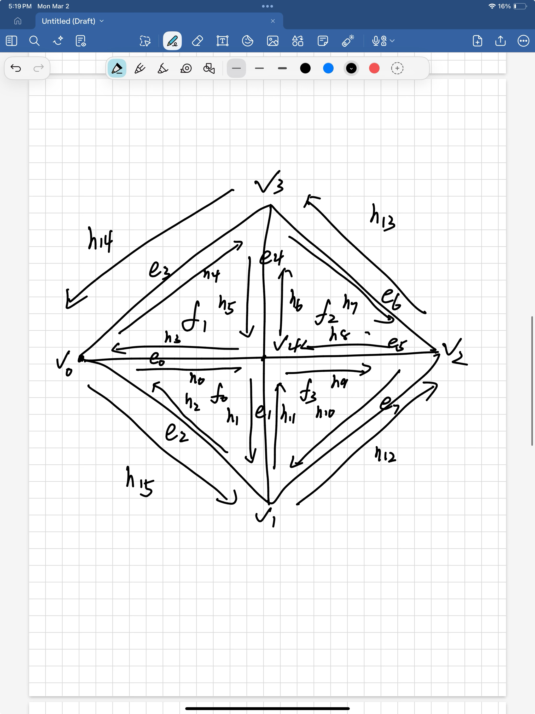
        <figcaption>Wrong "After" graph</figcaption>
      </td>
      <td>
        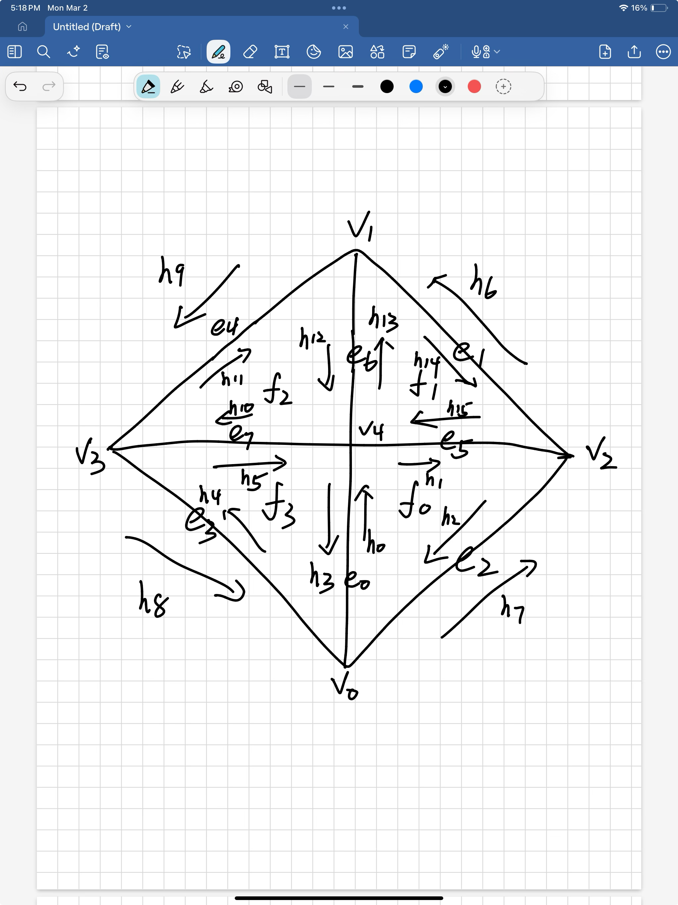
        <figcaption>Correct "After" graph</figcaption>
      </td>
    </tr>
  </table>

#### Q5. If you have implemented support for boundary edges, show screenshots of your implementation properly handling split operations on boundary edges.

  <table>
    <tr>
      <td>
        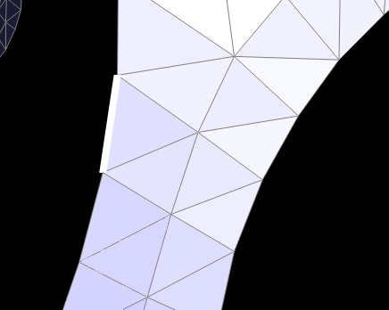
        <figcaption>Before boundary edge split</figcaption>
      </td>
      <td>
        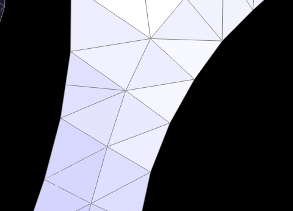
        <figcaption>After boundary edge split</figcaption>
      </td>
    </tr>
  </table>

### Part 6: Loop subdivision for mesh upsampling

#### Q1. Briefly explain how you implemented the loop subdivision and describe any interesting implementation / debugging tricks you have used.

Generally, I follow the spec and do the steps in order:

1. Reset all vertices/edges' `isNew = false` to avoid collision of multiple loop subdivision.
2. **Step A.1:** Compute the positions of new vertices: for boundary edges, see Q4 below; for internal edges, use halfedge traversal to find 4 neighbour vertices and compute the new position according to the formula: 3/8 &times; (A + B) + 1/8 &times; (C + D).
3. **Step A.2:** Compute the positions of old vertices: for boundary vertices, see Q4 below; for internal vertices, find all neighbours and compute the new position according to the formula: (1 - n &times; u) &times; original_position + u &times; original_neighbor_position_sum.
4. **Step B.1:** Split original edges: store all original edges first to avoid splitting newly created edges. For each original edge, split it and save the new vertex. Additionally, traverse all halfedges of the new vertex to find edges that connect a new vertex and an old vertex.
5. **Step B.2:** Flip new edges that connect a new vertex and an old vertex.
6. **Step C:** Update positions: update new vertex's position using `e::newPosition` and old vertex's position using `v::newPosition`.

#### Q2. Take some notes, as well as some screenshots, of your observations on how meshes behave after loop subdivision. What happens to sharp corners and edges? Can you reduce this effect by pre-splitting some edges?

  <table>
    <tr>
      <td>
        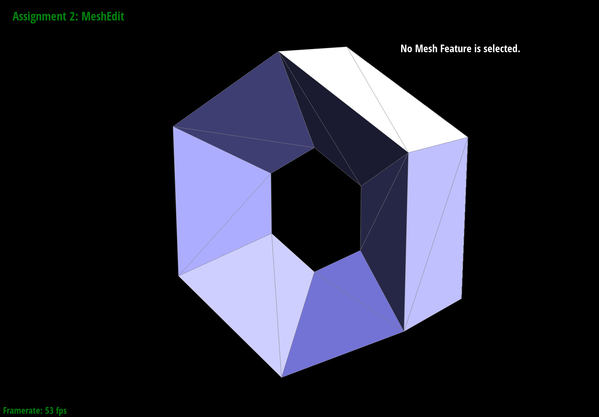
        <figcaption>Original torus</figcaption>
      </td>
      <td>
        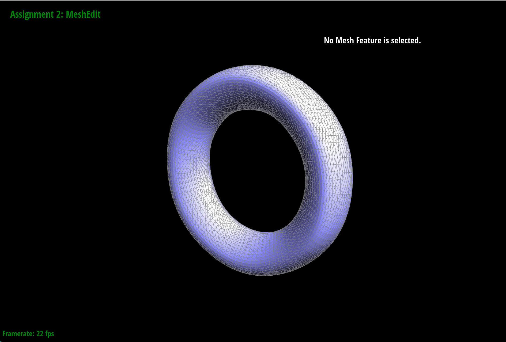
        <figcaption>Torus after 4 subdivisions</figcaption>
      </td>
    </tr>
    <tr>
      <td>
        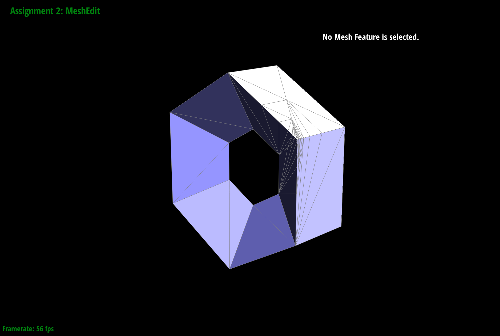
        <figcaption>Pre-split torus</figcaption>
      </td>
      <td>
        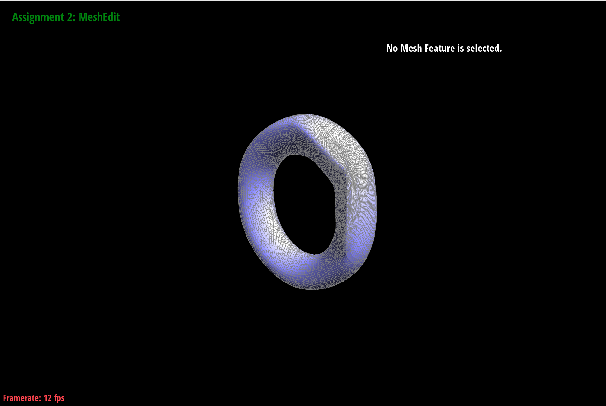
        <figcaption>Pre-split torus after 4 subdivisions</figcaption>
      </td>
    </tr>
  </table>

**What happens:** Sharp corners and edges become smooth after repeated subdivision.

**Reason:** Loop subdivision's update formula replaces each vertex position with a weighted average of itself and its neighbors: `(1 - n*u) * original_position + u * neighbor_position_sum`. This pulls every vertex toward the centroid of its neighbors, eroding sharp features over successive iterations.

**Pre-processing:** Pre-splitting edges near sharp corners increases the local vertex density. With more vertices packed tightly around a corner, the averaging effect stays localized. Each vertex's neighbors are closer to its original position, so the corner retains its shape better through subdivision.

#### Q3. Load dae/cube.dae. Perform several iterations of loop subdivision on the cube. Notice that the cube becomes slightly asymmetric after repeated subdivisions. Can you pre-process the cube with edge flips and splits so that the cube subdivides symmetrically? Document these effects and explain why they occur. Also explain how your pre-processing helps alleviate the effects.

  <table>
    <tr>
      <td>
        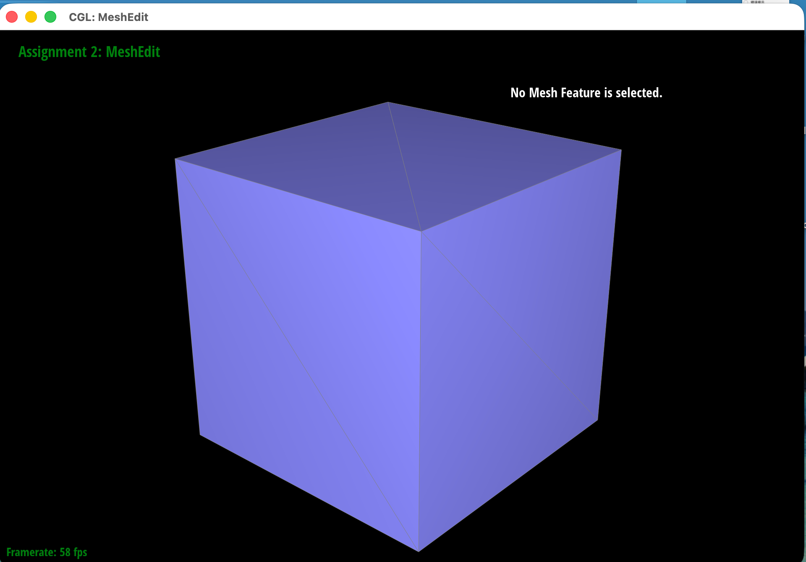
        <figcaption>Original cube</figcaption>
      </td>
      <td>
        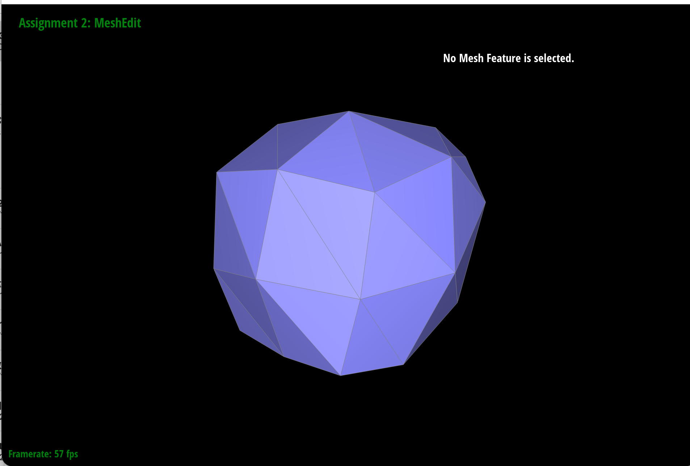
        <figcaption>Cube after 1 subdivision (asymmetric)</figcaption>
      </td>
    </tr>
    <tr>
      <td>
        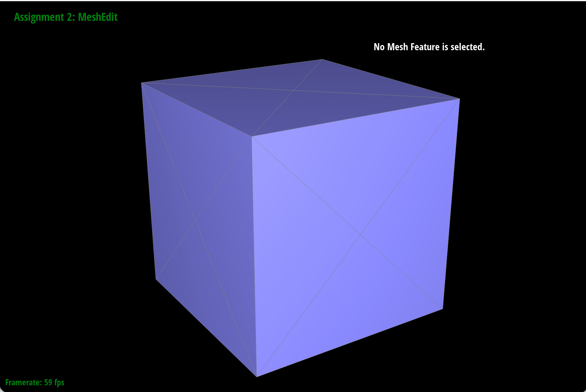
        <figcaption>Pre-processed cube (split diagonals)</figcaption>
      </td>
      <td>
        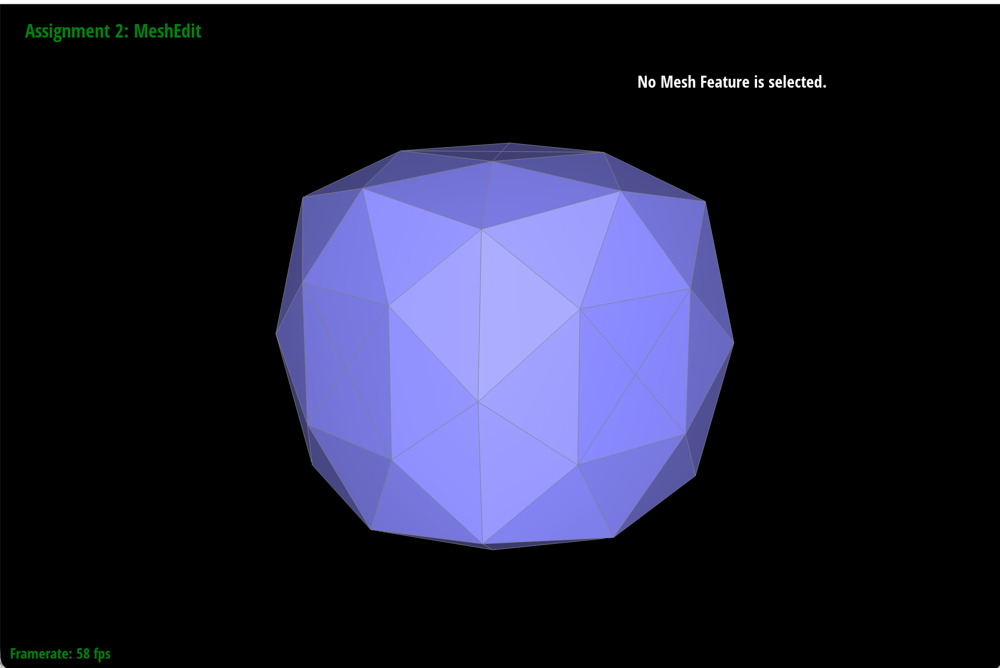
        <figcaption>Pre-processed cube after 1 subdivision (symmetric)</figcaption>
      </td>
    </tr>
  </table>

**Reason:** The original cube mesh has only one diagonal edge per face, and the diagonal directions are inconsistent across faces. This causes vertex degrees to range from 3 to 6 (specifically: 3, 4, 4, 4, 5, 5, 5, 6). In the Loop subdivision update formula, the self-weight `(1 - n*u)` depends on the vertex degree `n`. Vertices with lower degree (e.g., degree 3) receive a smaller self-weight and are pulled more strongly toward their neighbors, breaking the cube's symmetry.

**Pre-processing:** Split each face's diagonal so that all vertex degrees equal to 6, giving every vertex the same self-weight in the update formula, and the cube subdivides symmetrically.

#### Q4. Extra Credit

**Extra Credit 1: Support meshes with boundary**

According to H. Biermann, A. Levin, and D. Zorin, [_Piecewise smooth subdivision surfaces with normal control_](https://cims.nyu.edu/gcl/papers/biermann2000pss.pdf), Proceedings of SIGGRAPH 00, 2000, pp. 113–120: for boundary edges, the position of the new vertex should be the average of the two endpoints; for boundary vertices, the new position should be 3/4 of the old position + 1/8 &times; the sum of the two neighboring boundary vertices' positions.

**Extra Credit 2: Modified Butterfly subdivision scheme**

I implemented the modified Butterfly scheme. According to D. Zorin, P. Schröder, and W. Sweldens, [_Interpolating Subdivision for Meshes with Arbitrary Topology_](https://mrl.cs.nyu.edu/~dzorin/papers/zorin1996ism.pdf), the only difference is in the calculation of new vertex positions, and old vertices do not need to be updated. For boundary edges, the position of the new vertex should be -1/16 \* (position of the previous boundary vertex of one endpoint + position of the next boundary vertex of another endpoint) + 9/16 \* (sum of positions of two endpoints).

For internal edges, there are 3 cases:

1. Both endpoints have degree of 6: we can use the graph to illustrate the update rules:
   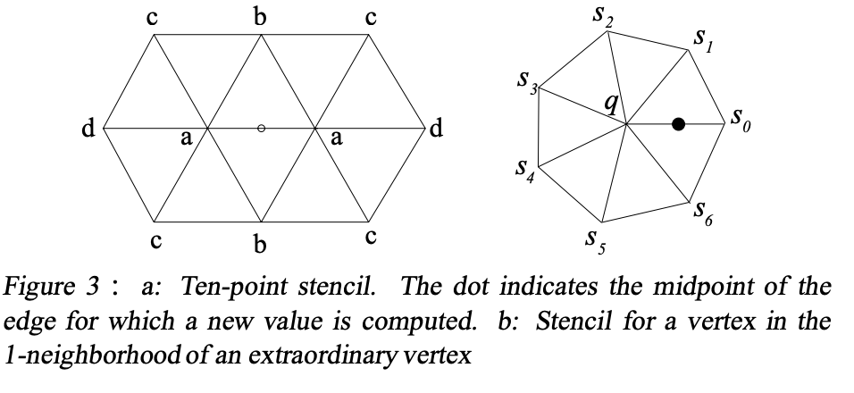
   where a = 1/2, b = 1/8, c = -1/16, d = 0
2. One endpoint has degree 6 and the other has degree K (K &ne; 6): only use the K neighbours of the irregular vertex. The new position is 3/4 \* old_position + the weighted sum of those neighbours' positions, where the weight for the j-th neighbour is s_j = (1/4 + cos(2&pi;j/K) + 1/2 cos(4&pi;j/K)) / K. Special cases: for K = 3, s_0 = 5/12, s_1 = s_2 = -1/12; for K = 4, s_0 = 3/8, s_2 = -1/8, s_1 = s_3 = 0.
3. Both endpoints do not have degree of 6: take the average of the values computed in case two.

  <table>
    <tr>
      <td>
        
        <figcaption>1 subdivision (Loop scheme)</figcaption>
      </td>
      <td>
        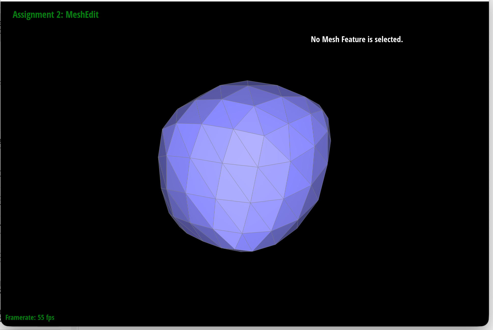
        <figcaption>2 subdivisions (Loop scheme)</figcaption>
      </td>
    </tr>
    <tr>
      <td>
        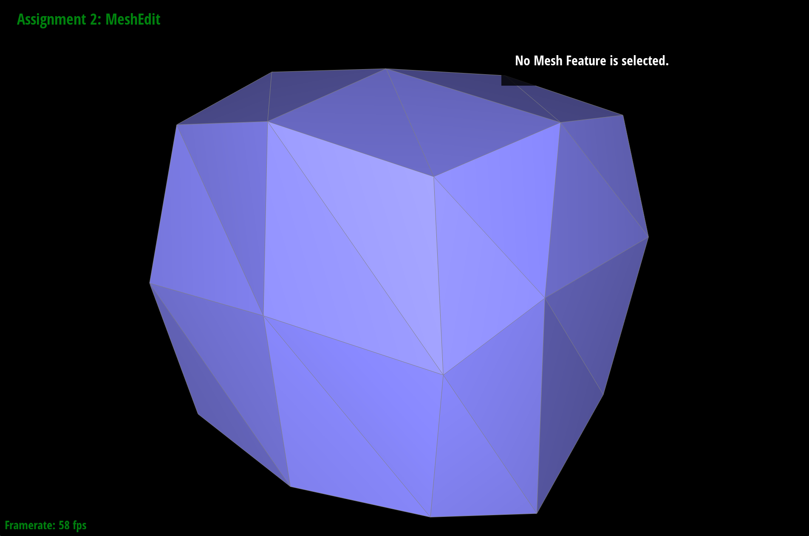
        <figcaption>1 subdivision (Butterfly scheme)</figcaption>
      </td>
      <td>
        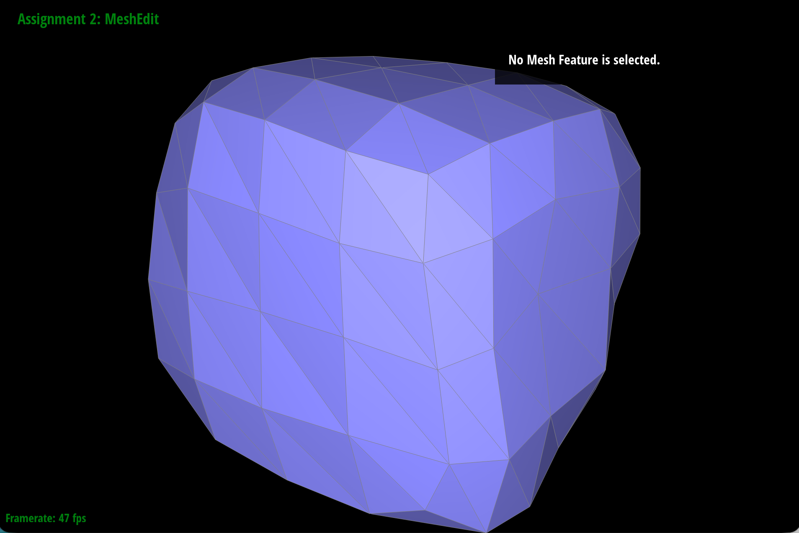
        <figcaption>2 subdivisions (Butterfly scheme)</figcaption>
      </td>
    </tr>
  </table>

