## Overview

In this project, I implemented a physically-based path tracer that simulates realistic light transport. The implementation progresses from basic ray generation and primitive intersection (Part 1), through BVH acceleration for efficient scene traversal (Part 2), direct illumination with both uniform hemisphere and importance sampling (Part 3), global illumination via recursive path tracing with Russian Roulette termination (Part 4), and adaptive sampling to concentrate computation where it is needed most (Part 5). For extra credit, I implemented Hammersley low-discrepancy pixel sampling.

Key takeaways:

- BVH acceleration transforms rendering from O(n) to O(log n) per ray, enabling scenes with hundreds of thousands of primitives to render in seconds instead of minutes.
- Importance sampling dramatically reduces noise compared to uniform hemisphere sampling, especially for small or distant light sources, because every sample has a higher chance of contributing non-zero radiance.
- Russian Roulette allows setting arbitrarily high max ray depth without proportional computation cost, while maintaining an unbiased estimate through the probability compensation factor.

## Part 1: Ray Generation and Scene Intersection

#### Q1. Walk through the ray generation and primitive intersection parts of the rendering pipeline.

Ray Generation:

1. Transform the coordinates from normalized image plane to virtual camera sensor plane
2. Transform the ray from camera space to world space
3. Set up parameters: normalize and set up r.min_t/r.max_t

Pixel Ray Generation:
For each pixel(x,y) generate num_samples rays. For each ray:

1. Sample random offset from [0,1] using gridSampler
2. Transform the coordinates from unnormalized image space to normalized image space
3. Get the estimate of radiance and incorporate it into the Monte Carlo estimate

Finally, update the pixel in sampleBuffer.

Primitive Intersection:

- **Triangles**: Compute t, b1, b2 using Moller-Trumbore Algorithm, then check whether t, b1, b2 satisfy the qualification.
- **Sphere**: Compute delta first to check whether they have an intersection. If they do, save the smaller of the two intersection times in t1 and the larger in t2, then check whether t1, t2 satisfy the qualification.

#### Q2. Explain the triangle intersection algorithm you implemented in your own words.

I use the Moller-Trumbore Algorithm. The idea is to set the ray equation equal to the barycentric interpolation of the triangle and solve for $t$, $b_1$, $b_2$ simultaneously.

A point on the ray is $\mathbf{O} + t\mathbf{D}$. A point on the triangle is $(1 - b_1 - b_2)\mathbf{P_1} + b_1\mathbf{P_2} + b_2\mathbf{P_3}$. Setting them equal:

$$\mathbf{O} + t\mathbf{D} = (1 - b_1 - b_2)\mathbf{P_1} + b_1\mathbf{P_2} + b_2\mathbf{P_3}$$

Rearranging into a linear system $\begin{bmatrix} -\mathbf{D} & \mathbf{E_1} & \mathbf{E_2} \end{bmatrix} \begin{bmatrix} t \\ b_1 \\ b_2 \end{bmatrix} = \mathbf{S}$, where $\mathbf{E_1} = \mathbf{P_2} - \mathbf{P_1}$, $\mathbf{E_2} = \mathbf{P_3} - \mathbf{P_1}$, $\mathbf{S} = \mathbf{O} - \mathbf{P_1}$.

Applying Cramer's rule with auxiliary vectors $\mathbf{S_1} = \mathbf{D} \times \mathbf{E_2}$ and $\mathbf{S_2} = \mathbf{S} \times \mathbf{E_1}$:

$$t = \frac{\mathbf{S_2} \cdot \mathbf{E_2}}{\mathbf{S_1} \cdot \mathbf{E_1}}, \quad b_1 = \frac{\mathbf{S_1} \cdot \mathbf{S}}{\mathbf{S_1} \cdot \mathbf{E_1}}, \quad b_2 = \frac{\mathbf{S_2} \cdot \mathbf{D}}{\mathbf{S_1} \cdot \mathbf{E_1}}$$

The intersection is valid only if: $t \in [\text{min\_t},\, \text{max\_t}]$, $b_1 \geq 0$, $b_2 \geq 0$, and $b_1 + b_2 \leq 1$.

#### Q3. Show images with normal shading for a few small .dae files.

<div class="image-grid">
  <table>
    <tr>
      <td>
        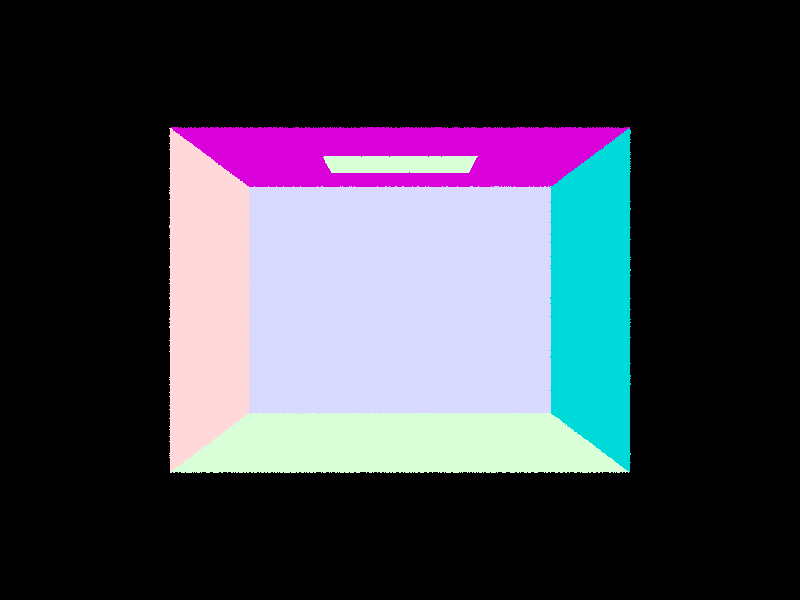
        <figcaption>CBempty.dae</figcaption>
      </td>
      <td>
        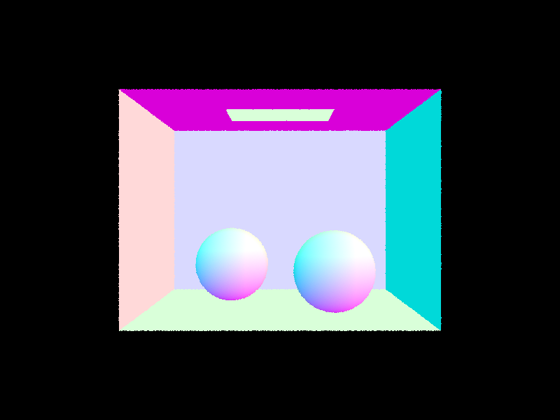
        <figcaption>CBspheres.dae</figcaption>
      </td>
    </tr>
    <tr>
      <td>
        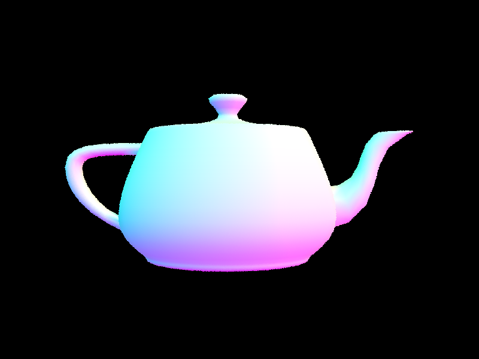
        <figcaption>teapot.dae</figcaption>
      </td>
    </tr>
  </table>
</div>

## Part 2: Bounding Volume Hierarchy

#### Q1. Walk through your BVH construction algorithm. Explain the heuristic you chose for picking the splitting point.

1. Compute the average centroid
2. If the total amount of primitives is no more than max_leaf_size, return a leaf node
3. If the amount is greater than max_leaf_size, then choose the longest axis of bbox to split because a longer axis is more likely to split primitives
4. If all primitives lie on only one side of the split point, simply let mid == start + (end - start) / 2 to split primitives equally.

#### Q2. Show images with normal shading for a few large .dae files that you can only render with BVH acceleration.

<div class="image-grid">
  <table>
    <tr>
      <td>
        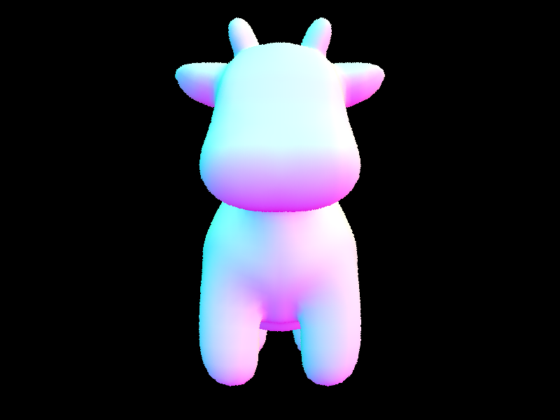
        <figcaption>cow.dae</figcaption>
      </td>
      <td>
        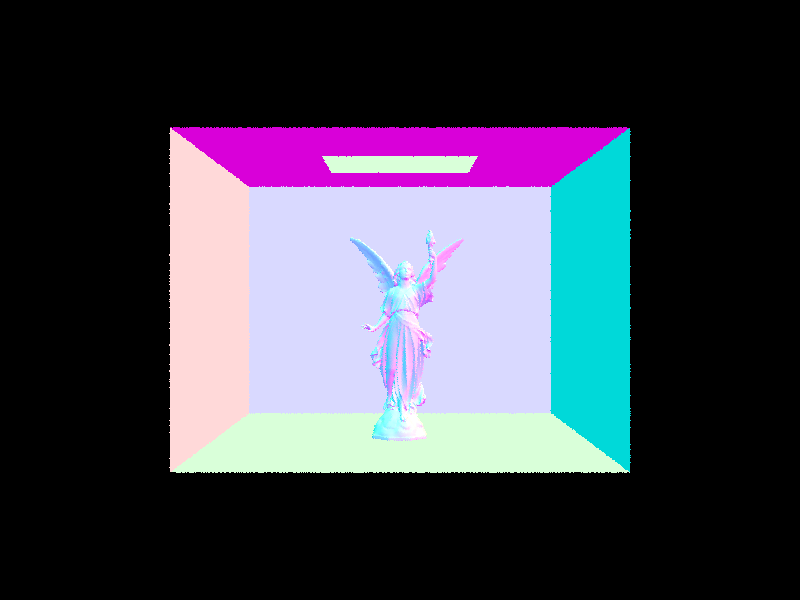
        <figcaption>CBlucy.dae</figcaption>
      </td>
    </tr>
  </table>
</div>

#### Q3. Compare rendering times on a few scenes with moderately complex geometries with and without BVH acceleration. Present your results in a one-paragraph analysis.

|   Scene    | Primitives | Render Time (No BVH) | Render Time (BVH) |  Speedup  | Intersection Tests/Ray (No BVH) | Intersection Tests/Ray (BVH) |
| :--------: | :--------: | :------------------: | :---------------: | :-------: | :-----------------------------: | :--------------------------: |
|  cow.dae   |   5,856    |        4.218s        |      0.032s       | **130x**  |             1100.7              |             6.1              |
| CBlucy.dae |  133,796   |       132.558s       |      0.030s       | **4360x** |             26335.7             |             6.3              |

The larger the scene, the greater the benefit of BVH: without BVH every ray tests against all primitives (O(n)), while BVH traversal reduces the cost to roughly O(log n).

## Part 3: Direct Illumination

#### Q1. Walk through both implementations of the direct lighting function.

**estimate_direct_lighting_hemisphere:**

1. Build a local coordinate system at the hit point with the surface normal aligned to the Z axis.
2. For each of the `num_samples` samples:
   1. Sample a direction `neg_w_j` uniformly on the hemisphere using `hemisphereSampler`.
   2. Create a shadow ray from `hit_p` in the world-space direction `o2w * neg_w_j`, with `min_t = EPS_F` to avoid self-intersection.
   3. Test if the ray hits an object. If it does and the object is a light source, get its emission by `get_emission()`. Otherwise, the emission is zero.
   4. Compute `cos_theta = dot(isect.n, o2w * neg_w_j)`.
   5. Accumulate the contribution using the Monte Carlo estimator: `f(w_out, neg_w_j) * L_i * cos_theta / pdf`, where `pdf = 1 / (2 * PI)` for uniform hemisphere sampling.
3. Divide the accumulated result by `num_samples` to get the average.

**estimate_direct_lighting_importance:**

The only difference between estimate_direct_lighting_hemisphere and estimate_direct_lighting_importance is casting direction: instead of sampling random directions on the hemisphere, estimate_direct_lighting_importance directly samples directions toward each light source, which is much more efficient since every sample has a chance of contributing non-zero radiance.

- For **delta (point) lights**: Only one sample is needed, since the direction from `hit_p` to the point light is deterministic. Call `light->sample_L` to get the casting direction, distance, and pdf. Cast a shadow ray with `max_t = distToLight - EPS_F` to check for occlusion. If unoccluded, compute the contribution.
- For **area lights**: Take `ns_area_light` samples per light. Each sample calls `light->sample_L` to get a random point on the light surface, then cast a shadow ray to check for occlusion. Average the contributions over the number of samples.

Finally, the contributions from all lights are summed to produce the final result.

#### Q2. Show some images rendered with both implementations of the direct lighting function.

<div class="image-grid">
  <table>
    <tr>
      <td>
        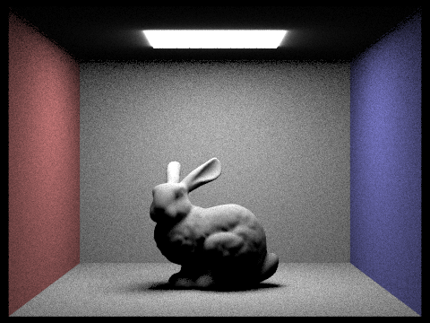
        <figcaption>CBbunny - Uniform Hemisphere Sampling</figcaption>
      </td>
      <td>
        
        <figcaption>CBbunny - Importance Sampling</figcaption>
      </td>
    </tr>
    <tr>
      <td>
        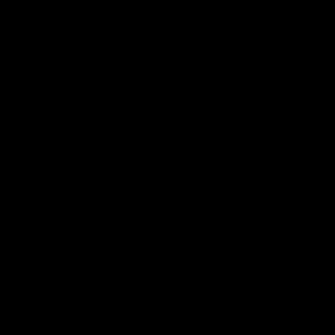
        <figcaption>Dragon - Uniform Hemisphere Sampling</figcaption>
      </td>
      <td>
        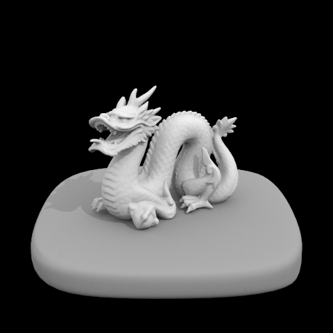
        <figcaption>Dragon - Importance Sampling</figcaption>
      </td>
    </tr>
  </table>
</div>

#### Q3. Focus on one particular scene with at least one area light and compare the noise levels in soft shadows when rendering with 1, 4, 16, and 64 light rays (the -l flag) and with 1 sample per pixel (the -s flag) using light sampling, not uniform hemisphere sampling.

<div class="image-grid">
  <table>
    <tr>
      <td>
        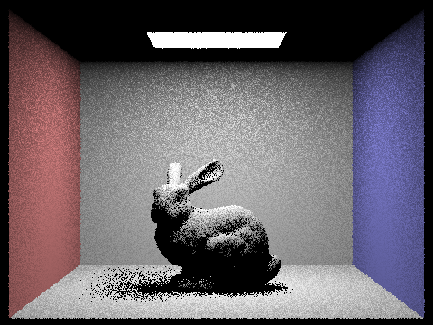
        <figcaption>1 Light Ray (s=1, l=1)</figcaption>
      </td>
      <td>
        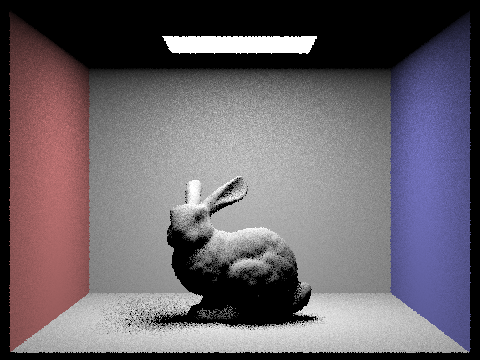
        <figcaption>4 Light Rays (s=1, l=4)</figcaption>
      </td>
    </tr>
    <tr>
      <td>
        
        <figcaption>16 Light Rays (s=1, l=16)</figcaption>
      </td>
      <td>
        
        <figcaption>64 Light Rays (s=1, l=64)</figcaption>
      </td>
    </tr>
  </table>
</div>

With 1 light ray, the image is extremely noisy — the soft shadows beneath the bunny appear as random black-and-white speckles, since each pixel only gets one chance to determine whether the light is occluded. At 4 light rays, the overall shape of the shadows becomes recognizable, but significant grain remains, especially at shadow boundaries. At 16 light rays, the noise is substantially reduced and the soft shadow gradients are mostly smooth. At 64 light rays, the image is nearly noise-free with clean, smooth soft shadows. This progression illustrates that increasing the number of light samples reduces the variance of the Monte Carlo estimator, producing smoother results.

#### Q4. Compare the results between uniform hemisphere sampling and lighting sampling in a one-paragraph analysis.

Uniform hemisphere sampling produces much noisier results compared to importance sampling at the same sample count. This is because hemisphere sampling picks directions randomly over the entire hemisphere, and the vast majority of these directions do not point toward a light source, contributing zero radiance. Only the rare samples that happen to hit a light source provide useful information, leading to high variance. Importance sampling, on the other hand, directly samples directions toward the light sources, so every sample has higher potential to contribute meaningful radiance. This makes each sample far more informative, resulting in significantly lower variance and faster convergence. The difference is especially striking for small or distant light sources, where hemisphere sampling would almost never find the light by chance (like in the dragon images).

## Part 4: Global Illumination

#### Q1. Walk through your implementation of the indirect lighting function.

1. First, call `one_bounce_radiance` to compute the direct lighting contribution at the current hit point.
2. Use `isect.bsdf->sample_f(w_out, &w_in, &pdf)` to sample an incoming direction `w_in` (in local coordinates) and its probability `pdf`.
3. Create a new ray from `hit_p` in the world-space direction `o2w * w_in`, with `min_t = EPS_F` to avoid self-intersection, and set `new_ray.depth = r.depth - 1` to avoid infinite recursion.
4. If the new ray intersects something in the scene, recursively call `at_least_one_bounce_radiance` on the new intersection to estimate the indirect radiance arriving from that direction.
5. Accumulate the indirect contribution using the Monte Carlo estimator: `f(w_out, w_in) * L_indirect * cos_theta / pdf`.
6. Russian Roulette is applied to probabilistically terminate rays beyond the first indirect bounce, with a termination probability of 0.35. When a ray survives, its contribution is divided by the continuation probability (0.65) to maintain an unbiased estimate.

#### Q2. Show some images rendered with global (direct and indirect) illumination. Use 1024 samples per pixel.

<div class="image-grid">
  <table>
    <tr>
      <td>
        
        <figcaption>CBbunny - Global Illumination (s=1024)</figcaption>
      </td>
      <td>
        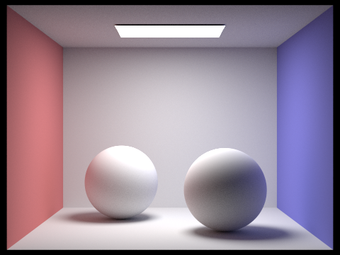
        <figcaption>CBspheres - Global Illumination (s=1024)</figcaption>
      </td>
    </tr>
  </table>
</div>

#### Q3. Pick one scene and compare rendered views first with only direct illumination, then only indirect illumination. Use 1024 samples per pixel.

<div class="image-grid">
  <table>
    <tr>
      <td>
        
        <figcaption>Direct Illumination Only</figcaption>
      </td>
      <td>
        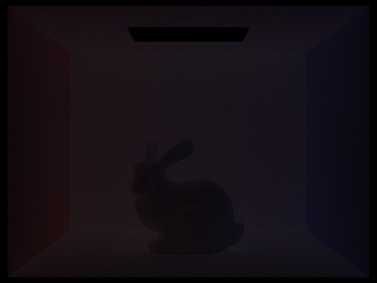
        <figcaption>Indirect Illumination Only</figcaption>
      </td>
    </tr>
  </table>
</div>

The direct illumination image shows sharp lighting from the light source with hard shadows — only surfaces that have a direct line of sight to the light are illuminated. The indirect illumination image reveals the softer, ambient lighting that comes from light bouncing off walls and objects. The ceiling is illuminated entirely by indirect light, and color bleeding from the red and blue walls onto the bunny and floor is visible. These indirect effects are what give path-traced images their realistic appearance compared to direct-only rendering.

#### Q4.1 For CBbunny.dae, render the mth bounce of light with max_ray_depth set to 0, 1, 2, 3, 4, and 5 (the -m flag), and isAccumBounces=false. Explain in your write-up what you see for the 2nd and 3rd bounce of light, and how it contributes to the quality of the rendered image compared to rasterization. Use 1024 samples per pixel.

<div class="image-grid">
  <table>
    <tr>
      <td>
        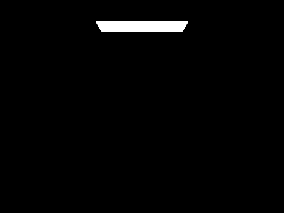
        <figcaption>m=0</figcaption>
      </td>
      <td>
        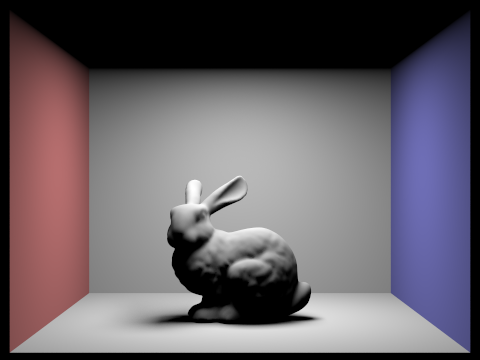
        <figcaption>m=1</figcaption>
      </td>
      <td>
        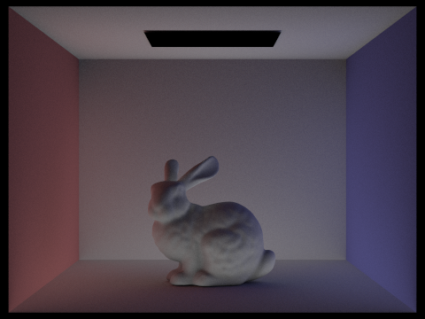
        <figcaption>m=2</figcaption>
      </td>
    </tr>
    <tr>
      <td>
        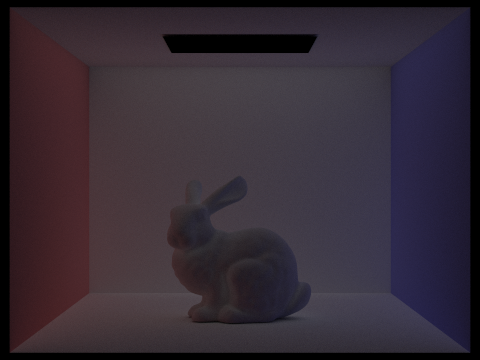
        <figcaption>m=3</figcaption>
      </td>
      <td>
        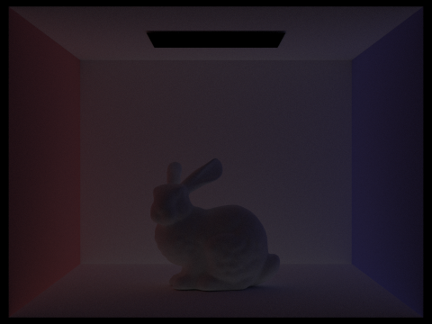
        <figcaption>m=4</figcaption>
      </td>
      <td>
        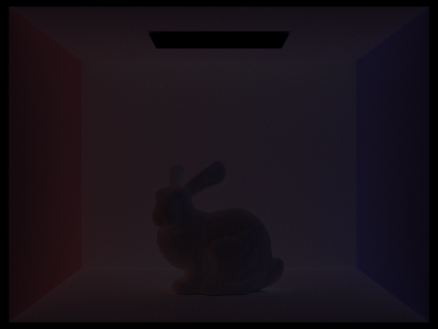
        <figcaption>m=5</figcaption>
      </td>
    </tr>
  </table>
</div>

- **m=2** (second bounce): The ceiling becomes visible and color bleeding from the red/blue walls begins to appear. This is the most significant indirect bounce.
- **m=3** (third bounce): The contribution is noticeably dimmer than the second bounce, as energy dissipates with each reflection.

The 2nd and 3rd bounces are critical for realistic rendering. Rasterization typically only handles direct lighting (m=1), missing the soft ambient illumination, color bleeding, and illumination of occluded areas that indirect bounces provide.

#### Q4.2 Compare rendered views of accumulated and unaccumulated bounces for CBbunny.dae with max_ray_depth set to 0, 1, 2, 3, 4, and 5 (the -m flag). Use 1024 samples per pixel.

| m   | Unaccumulated (isAccumBounces=false)  | Accumulated (isAccumBounces=true)   |
| --- | ------------------------------------- | ----------------------------------- |
| 0   |  | 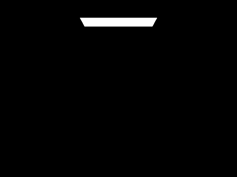 |
| 1   |  |  |
| 2   |  |  |
| 3   |  |  |
| 4   |  |  |
| 5   |  |  |

The unaccumulated column isolates each bounce individually, while the accumulated column sums all bounces from 0 to m. As m increases, the accumulated images converge to the full global illumination result. The unaccumulated images show that higher bounces contribute progressively less energy, confirming that the light transport converges.

#### Q5. For CBbunny.dae, output the Russian Roulette rendering with max_ray_depth set to 0, 1, 2, 3, 4, and 100 (the -m flag). Use 1024 samples per pixel.

<div class="image-grid">
  <table>
    <tr>
      <td>
        
        <figcaption>m=0</figcaption>
      </td>
      <td>
        
        <figcaption>m=1</figcaption>
      </td>
      <td>
        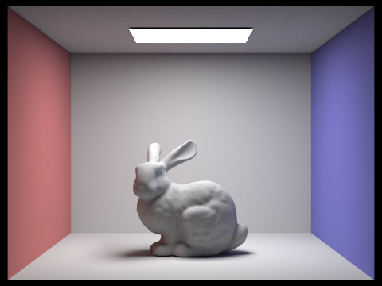
        <figcaption>m=2</figcaption>
      </td>
    </tr>
    <tr>
      <td>
        
        <figcaption>m=3</figcaption>
      </td>
      <td>
        
        <figcaption>m=4</figcaption>
      </td>
      <td>
        
        <figcaption>m=100</figcaption>
      </td>
    </tr>
  </table>
</div>

With Russian Roulette enabled, the images converge quickly. The m=4 (1036.69s) and m=100 (835.91s) results are virtually identical, demonstrating that Russian Roulette effectively allows the renderer to handle arbitrarily high max_ray_depth without significant additional computation cost. The probabilistic termination ensures that most rays are terminated after a few bounces, while the compensation factor maintains an unbiased estimate. This means we can set max_ray_depth to a very large number and still get converged results in a reasonable time.

#### Q6. Pick one scene and compare rendered views with various sample-per-pixel rates, including at least 1, 2, 4, 8, 16, 64, and 1024. Use 4 light rays.

<div class="image-grid">
  <table>
    <tr>
      <td>
        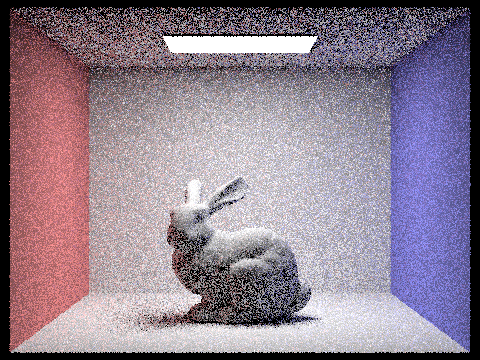
        <figcaption>s=1</figcaption>
      </td>
      <td>
        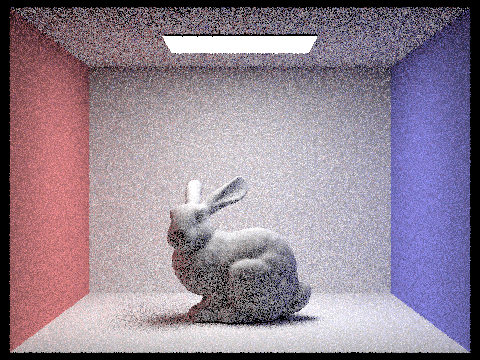
        <figcaption>s=2</figcaption>
      </td>
      <td>
        
        <figcaption>s=4</figcaption>
      </td>
      <td>
        
        <figcaption>s=8</figcaption>
      </td>
    </tr>
    <tr>
      <td>
        
        <figcaption>s=16</figcaption>
      </td>
      <td>
        
        <figcaption>s=64</figcaption>
      </td>
      <td>
        
        <figcaption>s=1024</figcaption>
      </td>
    </tr>
  </table>
</div>

At low sample rates (s=1, s=2), the image is extremely noisy with random speckles, as each pixel's radiance estimate has very high variance. As the sample count increases, the noise decreases: s=16 shows a recognizable but still grainy image, s=64 is substantially smoother, and s=1024 produces a clean, nearly noise-free result.

## Part 5: Adaptive Sampling

#### Q1. Explain adaptive sampling. Walk through your implementation of the adaptive sampling.

1. Setting while loop to ensure `actual_samples` less than `ns_aa`
2. For each sample, add it to `s_1` and `s_2`
3. Every `samplesPerBatch` samples, compute the convergence metric I
4. If `I <= maxTolerance * mu`, the pixel has converged and we stop sampling early. Otherwise, continue until reaching `ns_aa`.
5. Record the actual number of samples taken per pixel in `sampleCountBuffer` for visualization.

#### Q2. Pick two scenes and render them with at least 2048 samples per pixel. Show a good sampling rate image with clearly visible differences in sampling rate over various regions and pixels. Include both your sample rate image, which shows your how your adaptive sampling changes depending on which part of the image you are rendering, and your noise-free rendered result. Use 1 sample per light and at least 5 for max ray depth.

**CBbunny.dae:**

<div class="image-grid">
  <table>
    <tr>
      <td>
        
        <figcaption>CBbunny Rendered Result</figcaption>
      </td>
      <td>
        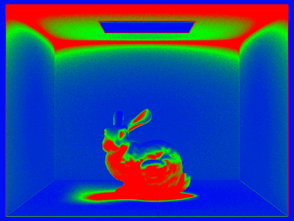
        <figcaption>CBbunny Sample Rate</figcaption>
      </td>
    </tr>
  </table>
</div>

**CBspheres_lambertian.dae:**

<div class="image-grid">
  <table>
    <tr>
      <td>
        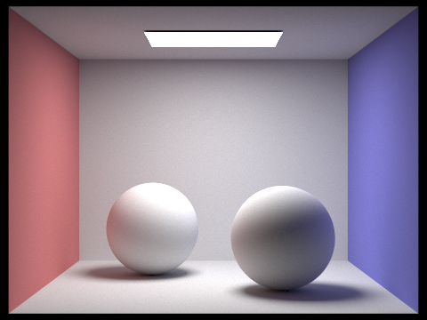
        <figcaption>CBspheres Rendered Result</figcaption>
      </td>
      <td>
        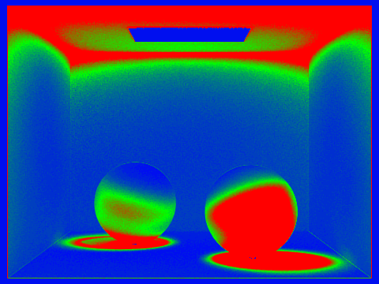
        <figcaption>CBspheres Sample Rate</figcaption>
      </td>
    </tr>
  </table>
</div>

In the sample rate images, blue regions indicate fewer samples and red regions indicate more samples. The walls and flat surfaces converge quickly since their illumination is relatively uniform. In contrast, shadow boundaries, edges of objects, and areas near the light source require significantly more samples due to higher variance in the radiance estimates. This demonstrates that adaptive sampling effectively allocates computational effort where it is most needed.

## Part 6: Extra Credit

### Hammersley Low-Discrepancy Pixel Sampling (Challenge Level 1)

#### Approach

We replaced the default random pixel sampler (`UniformGridSampler2D`) with a **Hammersley low-discrepancy sequence** to generate more uniformly distributed sample positions within each pixel.

#### Implementation

For $N$ total samples per pixel, the $i$-th Hammersley point is:

$$H_i = \left(\frac{i}{N},\; \Phi_2(i)\right)$$

where $\Phi_2(i)$ is the **radical inverse function in base 2**. It reverses the binary representation of $i$ and places it after the decimal point. For example:

- $i = 13$: binary $1101$ → reversed $0.1011$ → $0.6875$

We implemented the radical inverse function directly in `pathtracer.cpp`:

```cpp
double radical_inverse(int n)
{
  double result = 0.0;
  double base = 0.5;
  while (n > 0)
  {
    result += base * (n & 1);
    n >>= 1;
    base *= 0.5;
  }
  return result;
}
```

In `raytrace_pixel`, we replaced the random sampler call with the Hammersley point:

```cpp
// Before (random):
// Vector2D random_offset = this->gridSampler->get_sample();

// After (Hammersley):
Vector2D random_offset(
    (double)(actual_samples-1) / (double)num_samples,
    radical_inverse(actual_samples-1)
);
```

We use `ns_aa` (the maximum sample count) as $N$, which ensures the full sequence is well-distributed even if adaptive sampling terminates early.

#### Results and Comparison

We rendered `CBbunny.dae` at multiple sample rates using both the random sampler and the Hammersley sampler:

| Samples per pixel |                      Random                      |                      Hammersley                      |
| :---------------: | :----------------------------------------------: | :--------------------------------------------------: |
|         4         |     |     |
|        64         |    |    |
|        128        |   |   |
|        512        |   | 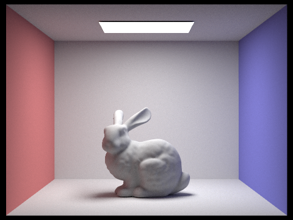  |
|       2048        |  |  |

Adaptive sampling rate comparison:

| Samples per pixel |                        Random                         |                        Hammersley                         |
| :---------------: | :---------------------------------------------------: | :-------------------------------------------------------: |
|         4         |     |     |
|        64         |  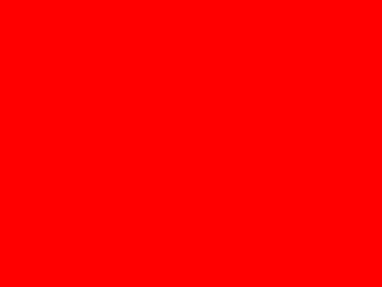  |    |
|        128        | 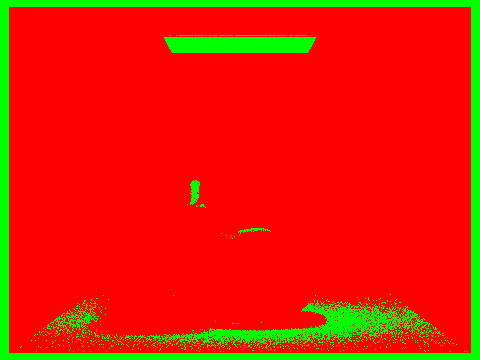  |   |
|        512        | 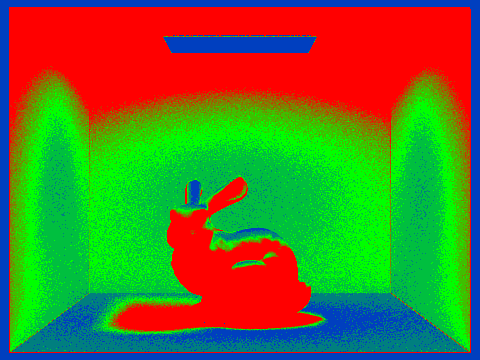  | 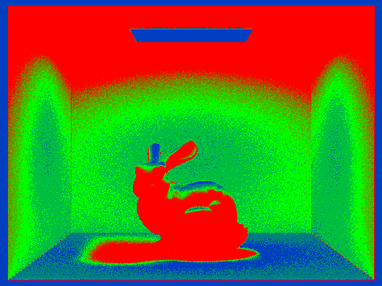  |
|       2048        |  |  |

#### Analysis

The visual difference between the two methods is **minimal** across all sample counts. This reveals an important insight about where variance originates in a path tracer.

The pixel sampler only controls the 2D position within each pixel where a camera ray is cast. However, the dominant sources of noise in path tracing are:

1. **Light source sampling** — random points on area lights during direct illumination estimation
2. **BSDF direction sampling** — random cosine-weighted hemisphere directions for indirect illumination

These downstream sampling dimensions all still use pseudorandom numbers, and their variance far exceeds the variance contributed by pixel position. The Hammersley sequence improves the uniformity of only 2 dimensions out of potentially dozens used per sample, so its impact on the final image quality is negligible.
